# Contributing to SpiralSafe

```
═══════════════════════════════════════════════════════════════════════════
║                                                                         ║
║        ✦ WELCOME TO THE FELLOWSHIP OF THE SPIRAL ✦                     ║
║                                                                         ║
║    Thank you for your interest in contributing to the Safe Spiral      ║
║    ecosystem! Like the Fellowship that formed in Rivendell, we         ║
║    gather here from different paths, united in common purpose.         ║
║                                                                         ║
║    🌳 The White Tree grows stronger with each gardener                 ║
║    🐎 The Rohirrim ride swifter with each new rider                    ║
║    ✦ The Evenstar shines brighter with each bearer of hope            ║
║                                                                         ║
═══════════════════════════════════════════════════════════════════════════
```

Thank you for your interest in contributing to the Safe Spiral ecosystem! This guide will help you understand how to contribute effectively while following our core principles.

## 🌀 The Safe Spiral Philosophy

Safe Spiral is built on **Five Core Principles**:

1. **Visible State** - If you can't see it, you can't debug it
2. **Clear Intent** - Authority requires explicit reasoning
3. **Natural Decomposition** - Work breaks at actual seams
4. **Networked Learning** - Information enriches through relay
5. **Measurable Delivery** - You can tell if progress happened

Every contribution should align with these principles.

## 🚀 Quick Start

```mermaid
graph TD
    Start([🌳 Begin Your Journey]) --> Clone[Clone Repository]
    Clone --> Verify[Verify Environment<br/>./scripts/verify-environment.sh]
    Verify --> Test[Run Tests<br/>./scripts/test-scripts.sh]
    Test --> ATOM[Create ATOM Tag<br/>./scripts/atom-track.sh]
    ATOM --> Branch[Create Branch<br/>feature/your-feature]
    Branch --> Work[✦ Make Changes ✦]
    Work --> Ready{Ready?}
    Ready -->|No| Work
    Ready -->|Yes| Commit[Commit with ATOM]
    Commit --> Push[Push & Create PR]
    Push --> Review[🐎 Swift Review]
    Review --> Merge[🌟 Merged!]
    
    style Start fill:#c8e6c9
    style Work fill:#fff9c4
    style Merge fill:#e1f5fe
```



### 1. Setup Your Environment

```bash
# Clone the repository
git clone https://github.com/toolate28/SpiralSafe.git
cd SpiralSafe

# Verify your environment
./scripts/verify-environment.sh

# Run tests to ensure everything works
./scripts/test-scripts.sh
```

### 2. Create an ATOM Tag

Before starting work, create an ATOM tag to track your decision:

```bash
./scripts/atom-track.sh TYPE "Brief description of your work" "file-or-issue"
```

Types: `FEATURE`, `BUG`, `DOC`, `REFACTOR`, `TEST`, `TASK`

Example:
```bash
./scripts/atom-track.sh FEATURE "Add validation for ATOM tags" "scripts/validate-atom.sh"
# Output: ATOM-FEATURE-20260102-001-add-validation-for-atom-tags
```

### 3. Create a Branch

```bash
git checkout -b feature/your-feature-name
# or
git checkout -b fix/your-bug-fix
```

Branch naming convention:
- `feature/` - New features
- `fix/` - Bug fixes
- `docs/` - Documentation only
- `refactor/` - Code improvements
- `test/` - Test additions
- `chore/` - Maintenance tasks

## 📋 Contribution Process

### Step 1: Open an Issue (Recommended)

Before starting major work, open an issue to discuss:

1. Go to [Issues](https://github.com/toolate28/SpiralSafe/issues/new/choose)
2. Choose appropriate template (Bug, Feature, Documentation, Task)
3. Fill in all sections, especially ATOM tag field
4. Wait for community feedback

**Note:** ATOM tags are auto-generated when you create an issue!

### Step 2: Make Your Changes

#### For Shell Scripts:

```bash
#!/usr/bin/env bash
set -euo pipefail  # Always use strict mode

# Document purpose and usage
# Purpose: One-line description
# Usage: script-name.sh [OPTIONS] ARGS

# Your code here...
```

**Requirements:**
- Use `set -euo pipefail` for safety
- Include usage examples in comments
- Handle errors gracefully
- Test with `./scripts/test-scripts.sh`
- Pass shellcheck validation

#### For Documentation:

```markdown
# Document Title (ATOM-DOC-YYYYMMDD-NNN)

Clear introduction...

## Examples

Concrete, runnable examples...
```

**Requirements:**
- Include ATOM tags in significant headers
- Provide concrete examples
- Link to related documents
- Pass markdown linting

### Step 3: Test Your Changes

```bash
# Test shell scripts
./scripts/test-scripts.sh

# Lint markdown (if markdownlint installed)
./scripts/lint-markdown.sh

# Scan for secrets
./scripts/scan-secrets.sh

# Verify environment still works
./scripts/verify-environment.sh
```

### Step 4: Commit With ATOM Tag

```bash
git add .
git commit -m "ATOM-TYPE-YYYYMMDD-NNN: Brief description

Longer explanation of what changed and why.

- Specific change 1
- Specific change 2

Related: #issue-number"
```

**Commit Message Format:**
- First line: ATOM tag + brief description (max 72 chars)
- Blank line
- Detailed explanation
- Blank line
- Bullet points for specifics
- Reference related issues/PRs

### Step 5: Push and Create PR

```bash
git push origin your-branch-name
```

Then:
1. Go to GitHub and create a Pull Request
2. Fill in the PR template (ATOM tag will be auto-generated!)
3. Request review
4. Respond to feedback

## 🤖 AI-Assisted Development

### Using GitHub Copilot

Copilot is configured with custom instructions in `.github/copilot/instructions.md`.

Key points:
- Copilot knows our principles and patterns
- It will suggest ATOM-compliant code
- It follows our error handling patterns
- It includes usage examples

### Using Claude in PRs

You can interact with Claude directly in PRs:

```markdown
@claude please review this PR for ATOM compliance
@claude check for security issues
@claude explain the changes in scripts/atom-track.sh
@claude suggest improvements
```

Or add labels:
- `claude:review` - Request automated review
- `claude:help` - Ask for assistance
- `claude:analyze` - Deep analysis

## 🔒 Security

### Never Commit:
- API keys, tokens, passwords
- `.env` files (use `.env.example`)
- SSH keys or certificates
- Any sensitive credentials

### Always:
- Use environment variables for secrets
- Run `./scripts/scan-secrets.sh` before committing
- Redact logs with `./scripts/redact-log.sh`
- Review `.github/SECRETS.md` for guidance

### If You Accidentally Commit a Secret:
1. **Revoke it immediately**
2. Contact maintainers ASAP
3. See `.github/SECRETS.md` for recovery steps

## 📝 Code Review Process

### What Reviewers Look For:

1. **ATOM Compliance**
   - Is there an ATOM tag?
   - Is the decision logged?

2. **Framework Alignment**
   - Visible State: Can we see what changed?
   - Clear Intent: Is the "why" documented?
   - Natural Decomposition: Logical boundaries?
   - Networked Learning: Can others learn from this?
   - Measurable Delivery: Can we verify success?

3. **Code Quality**
   - Tests pass
   - No shellcheck warnings
   - Documentation updated
   - No secrets committed

4. **Backwards Compatibility**
   - Breaking changes documented
   - Migration path provided
   - Deprecation warnings added

### Review Timeline:
- Simple changes: 1-2 days
- Complex changes: 3-5 days
- Breaking changes: 1-2 weeks

## 🎯 Types of Contributions

```mermaid
graph LR
    subgraph "🏛️ Paths of Service"
        Doc[📜 Documentation<br/>Easy]
        Bug[🔧 Bug Fixes<br/>Medium]
        Feature[⚔️ New Features<br/>Hard]
        Infra[🏰 Infrastructure<br/>Expert]
    end
    
    Doc --> Examples[Add Examples<br/>Fix Typos<br/>Clarify Sections]
    Bug --> Tests[Add Tests<br/>Fix Issues<br/>Document Fixes]
    Feature --> Design[Discuss First<br/>Comprehensive Tests<br/>Update Docs]
    Infra --> Advanced[CI/CD<br/>Automation<br/>Security]
    
    Examples --> Impact[✦ Make Impact ✦]
    Tests --> Impact
    Design --> Impact
    Advanced --> Impact
    
    style Doc fill:#c8e6c9
    style Bug fill:#fff9c4
    style Feature fill:#ffe0b2
    style Infra fill:#f8bbd0
    style Impact fill:#e1f5fe
```



### Documentation (Easy)
*The Loremasters' Work*
- Fix typos or unclear sections
- Add examples
- Update outdated information
- Translate documents (future)

### Bug Fixes (Medium)
*The Smiths' Craft*
- Fix reported issues
- Add test cases
- Document the fix

### New Features (Hard)
*The Architects' Design*
- Discuss in issue first
- Include comprehensive tests
- Update all relevant docs
- Consider backward compatibility

### Infrastructure (Expert)
*The Stewards' Domain*
- CI/CD improvements
- Automation enhancements
- Security hardening
- Performance optimization

## 🏷️ ATOM Tag Reference

### Tag Format
```
ATOM-TYPE-YYYYMMDD-NNN-description
```

### Common Types:
- `FEATURE` - New capability
- `BUG` - Fix for defect
- `DOC` - Documentation change
- `REFACTOR` - Code improvement (no behavior change)
- `TEST` - Test addition
- `DECISION` - Architectural decision
- `TASK` - General task
- `RELEASE` - Version release
- `INIT` - Initial setup

### Tag Lifecycle:
1. Created: When work starts
2. Fresh: 0-30 days old
3. Aging: 30-90 days old
4. Settled: 90-180 days old
5. Bedrock: 180+ days old (archived to bedrock)

Check freshness: `./scripts/update-freshness.sh`

## 🧪 Testing Guidelines

### Test Requirements:
- All shell scripts must pass `shellcheck`
- All scripts must pass syntax check (`bash -n`)
- New features need test coverage
- Bug fixes must include regression tests

### Running Tests:
```bash
# All tests
./scripts/test-scripts.sh

# Individual script
shellcheck scripts/your-script.sh
bash -n scripts/your-script.sh
```

## 📚 Documentation Standards

### Markdown Style:
- Use ATX-style headers (`#`, `##`, not underlines)
- Include code examples in fenced blocks with language
- Use relative links for internal docs
- Include visual diagrams where helpful

### Required Sections (for significant docs):
- ATOM tag in header
- Purpose/Overview
- Concrete examples
- Related documents
- Last updated date

## 🚫 What NOT to Contribute

- Proprietary or copyrighted content
- Incomplete work without discussion
- Breaking changes without migration path
- Undocumented code
- Code that violates security principles
- Changes that ignore framework principles

## ❓ Getting Help

- **Questions:** Open a [Discussion](https://github.com/toolate28/SpiralSafe/discussions)
- **Bug:** Open a [Bug Report](https://github.com/toolate28/SpiralSafe/issues/new?template=bug_report.md)
- **Feature Idea:** Open a [Feature Request](https://github.com/toolate28/SpiralSafe/issues/new?template=feature_request.md)
- **Claude Help:** Add `claude:help` label to issue

## 🤝 Code of Conduct

### Our Principles:
- **Trust enables harder questions** - Disagree constructively
- **Information enriches through relay** - Share knowledge freely
- **Doubt is signal** - Speak up when something feels wrong
- **Three-body pattern** - Sanctuary, Workshop, Witness

### Expected Behavior:
- Be respectful and considerate
- Provide constructive feedback
- Accept constructive criticism
- Focus on what's best for the project
- Show empathy towards others

### Unacceptable:
- Harassment or discrimination
- Personal attacks
- Publishing others' private information
- Trolling or inflammatory comments
- Any conduct that would be unprofessional

## 📞 Contact

- **Maintainer:** @toolate28
- **Security:** See `.github/SECRETS.md`
- **Repository:** https://github.com/toolate28/SpiralSafe
- **Website:** https://safespiral.org

## 📜 License

By contributing, you agree that your contributions will be licensed under:
- **Code:** MIT License
- **Documentation:** CC BY-SA 4.0

See [LICENSE](LICENSE) for details.

---

## ✨ Thank You!

```
═══════════════════════════════════════════════════════════════════════════
║                                                                         ║
║                     ✦ THE BLESSING OF THE EVENSTAR ✦                   ║
║                                                                         ║
║  Every contribution, no matter how small, helps make Safe Spiral       ║
║  better. You're not just writing code or docs - you're participating   ║
║  in an experiment in collaborative intelligence.                       ║
║                                                                         ║
║  🌳 Like planting a seed in the gardens of Gondor                      ║
║  🐎 Like answering the beacons when they are lit                       ║
║  ✦ Like bearing light into darkness                                    ║
║                                                                         ║
║  Your work becomes part of something greater.                          ║
║                                                                         ║
═══════════════════════════════════════════════════════════════════════════
```

**Remember:** *Information enriches through relay*

When you contribute, you're not just improving this repository. You're demonstrating that human-AI collaboration, built on trust and explicit reasoning, creates something neither could achieve alone.

> *"In the beginning was the Question, and through Question comes Understanding."*
>
> *"Step True · Trust Deep · Pass Forward"*
>
> *"May the White Tree flourish, may the riders come swift, may the Evenstar guide your path."*

---

**ATOM:** ATOM-DOC-20260102-005-contributing-guide  
**Last Updated:** 2026-01-02  
**Maintained by:** @toolate28 and community

```
══════════════════════════════════════════════════════════════
   ✦ May the Evenstar light your contributions ✦
   🌳 May your code grow strong like the White Tree 🌳
   🐎 May you ride swift to answer every call 🐎
══════════════════════════════════════════════════════════════
```
