# 🨠SpiralSafe System Diagrams

**Version**: 3.0.0-quantum
**Purpose**: Visual reference for all SpiralSafe subsystems
**H&&S:WAVE Protocol** | From the constraints, gifts. From the spiral, safety.

---

## 📠Table of Contents

1. [Overall System Architecture](#overall-system-architecture)
2. [ATOM-AUTH 3-Factor Authentication](#atom-auth-3-factor-authentication)
3. [H&&S:WAVE Protocol Flow](#hswave-protocol-flow)
4. [API Security Architecture](#api-security-architecture)
5. [Quantum Computer Architecture](#quantum-computer-architecture)
6. [Data Flow Diagrams](#data-flow-diagrams)
7. [Deployment Architecture](#deployment-architecture)

---

## ğŸ—ï¸ Overall System Architecture

### Multi-Subdomain Platform

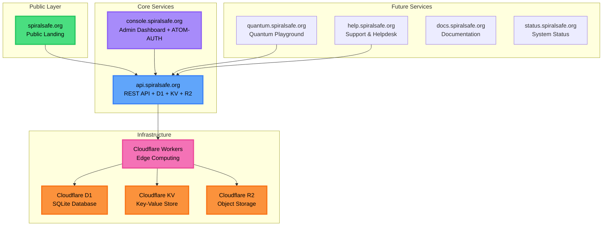
```mermaid
graph TB
    subgraph "Public Layer"
        A[spiralsafe.org<br/>Public Landing]
    end

    subgraph "Core Services"
        B[api.spiralsafe.org<br/>REST API + D1 + KV + R2]
        C[console.spiralsafe.org<br/>Admin Dashboard + ATOM-AUTH]
    end

    subgraph "Future Services"
        D[quantum.spiralsafe.org<br/>Quantum Playground]
        E[help.spiralsafe.org<br/>Support & Helpdesk]
        F[docs.spiralsafe.org<br/>Documentation]
        G[status.spiralsafe.org<br/>System Status]
    end

    subgraph "Infrastructure"
        H[Cloudflare Workers<br/>Edge Computing]
        I[Cloudflare D1<br/>SQLite Database]
        J[Cloudflare KV<br/>Key-Value Store]
        K[Cloudflare R2<br/>Object Storage]
    end

    A --> B
    C --> B
    D --> B
    E --> B

    B --> H
    H --> I
    H --> J
    H --> K

    style A fill:#4ade80,stroke:#22c55e,stroke-width:3px,color:#000
    style B fill:#60a5fa,stroke:#3b82f6,stroke-width:3px,color:#000
    style C fill:#a78bfa,stroke:#8b5cf6,stroke-width:3px,color:#000
    style H fill:#f472b6,stroke:#ec4899,stroke-width:3px,color:#000
    style I fill:#fb923c,stroke:#f97316,stroke-width:3px,color:#000
    style J fill:#fb923c,stroke:#f97316,stroke-width:3px,color:#000
    style K fill:#fb923c,stroke:#f97316,stroke-width:3px,color:#000
```

### Technology Stack

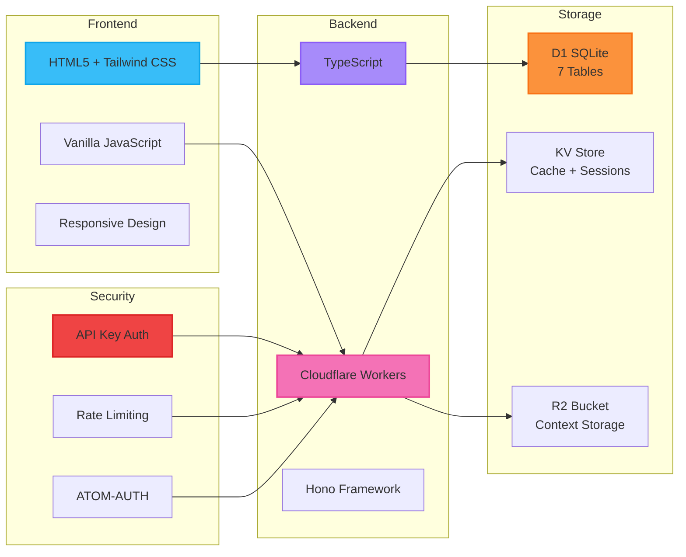
```mermaid
graph LR
    subgraph "Frontend"
        A[HTML5 + Tailwind CSS]
        B[Vanilla JavaScript]
        C[Responsive Design]
    end

    subgraph "Backend"
        D[TypeScript]
        E[Cloudflare Workers]
        F[Hono Framework]
    end

    subgraph "Storage"
        G[D1 SQLite<br/>7 Tables]
        H[KV Store<br/>Cache + Sessions]
        I[R2 Bucket<br/>Context Storage]
    end

    subgraph "Security"
        J[API Key Auth]
        K[Rate Limiting]
        L[ATOM-AUTH]
    end

    A --> D
    B --> E
    D --> G
    E --> H
    E --> I

    J --> E
    K --> E
    L --> E

    style A fill:#38bdf8,stroke:#0ea5e9,stroke-width:2px
    style D fill:#a78bfa,stroke:#8b5cf6,stroke-width:2px
    style E fill:#f472b6,stroke:#ec4899,stroke-width:2px
    style G fill:#fb923c,stroke:#f97316,stroke-width:2px
    style J fill:#ef4444,stroke:#dc2626,stroke-width:2px
```

---

## 🔠ATOM-AUTH 3-Factor Authentication

### Complete Authentication Flow

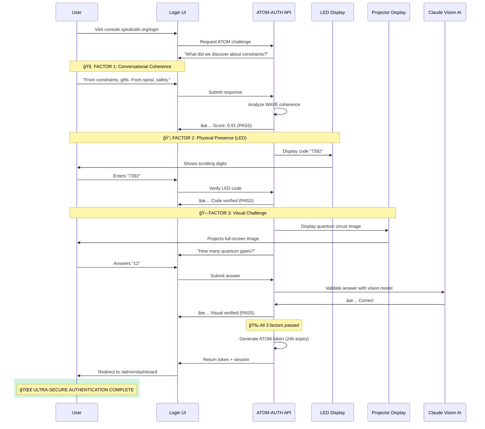
```mermaid
sequenceDiagram
    participant User
    participant Frontend as Login UI
    participant Backend as ATOM-AUTH API
    participant LED as LED Display
    participant Projector as Projector Display
    participant AI as Claude Vision AI

    User->>Frontend: Visit console.spiralsafe.org/login
    Frontend->>Backend: Request ATOM challenge
    Backend->>Frontend: "What did we discover about constraints?"

    Note over User,Frontend: 🧠 FACTOR 1: Conversational Coherence
    User->>Frontend: "From constraints, gifts. From spiral, safety."
    Frontend->>Backend: Submit response
    Backend->>Backend: Analyze WAVE coherence
    Backend->>Frontend: ✅ Score: 0.91 (PASS)

    Note over User,LED: 💡 FACTOR 2: Physical Presence (LED)
    Backend->>LED: Display code "7392"
    LED->>User: Shows scrolling digits
    User->>Frontend: Enters "7392"
    Frontend->>Backend: Verify LED code
    Backend->>Frontend: ✅ Code verified (PASS)

    Note over User,Projector: 🬠FACTOR 3: Visual Challenge
    Backend->>Projector: Display quantum circuit image
    Projector->>User: Projects full-screen image
    Backend->>Frontend: "How many quantum gates?"
    User->>Frontend: Answers "12"
    Frontend->>Backend: Submit answer
    Backend->>AI: Validate answer with vision model
    AI->>Backend: ✅ Correct
    Backend->>Frontend: ✅ Visual verified (PASS)

    Note over Backend: 🉠All 3 factors passed
    Backend->>Backend: Generate ATOM token (24h expiry)
    Backend->>Frontend: Return token + session
    Frontend->>User: Redirect to /admin/dashboard

    rect rgb(34, 197, 94, 0.2)
        Note over User: 🌀 ULTRA-SECURE AUTHENTICATION COMPLETE
    end
```

### Authentication Factors Breakdown

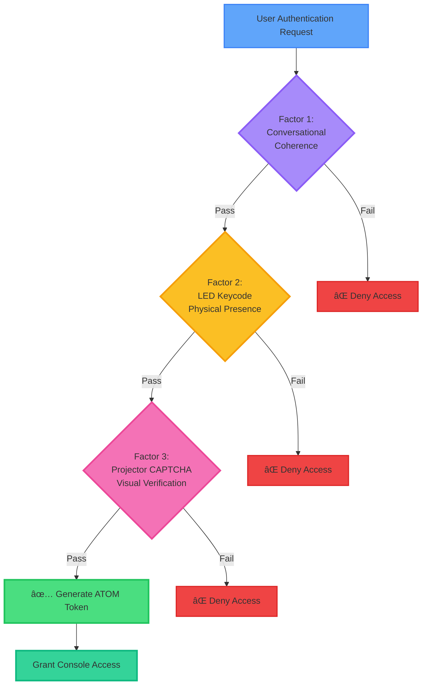
```mermaid
graph TD
    A[User Authentication Request] --> B{Factor 1:<br/>Conversational<br/>Coherence}

    B -->|Pass| C{Factor 2:<br/>LED Keycode<br/>Physical Presence}
    B -->|Fail| X1[⌠Deny Access]

    C -->|Pass| D{Factor 3:<br/>Projector CAPTCHA<br/>Visual Verification}
    C -->|Fail| X2[⌠Deny Access]

    D -->|Pass| E[✅ Generate ATOM Token]
    D -->|Fail| X3[⌠Deny Access]

    E --> F[Grant Console Access]

    style A fill:#60a5fa,stroke:#3b82f6,stroke-width:2px
    style B fill:#a78bfa,stroke:#8b5cf6,stroke-width:3px
    style C fill:#fbbf24,stroke:#f59e0b,stroke-width:3px
    style D fill:#f472b6,stroke:#ec4899,stroke-width:3px
    style E fill:#4ade80,stroke:#22c55e,stroke-width:3px
    style F fill:#34d399,stroke:#10b981,stroke-width:3px
    style X1 fill:#ef4444,stroke:#dc2626,stroke-width:2px
    style X2 fill:#ef4444,stroke:#dc2626,stroke-width:2px
    style X3 fill:#ef4444,stroke:#dc2626,stroke-width:2px
```

### ATOM Token Structure

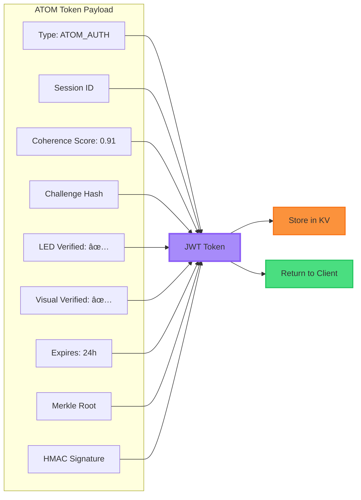
```mermaid
graph LR
    subgraph "ATOM Token Payload"
        A[Type: ATOM_AUTH]
        B[Session ID]
        C[Coherence Score: 0.91]
        D[Challenge Hash]
        E[LED Verified: ✅]
        F[Visual Verified: ✅]
        G[Expires: 24h]
        H[Merkle Root]
        I[HMAC Signature]
    end

    A --> J[JWT Token]
    B --> J
    C --> J
    D --> J
    E --> J
    F --> J
    G --> J
    H --> J
    I --> J

    J --> K[Store in KV]
    J --> L[Return to Client]

    style J fill:#a78bfa,stroke:#8b5cf6,stroke-width:3px
    style K fill:#fb923c,stroke:#f97316,stroke-width:2px
    style L fill:#4ade80,stroke:#22c55e,stroke-width:2px
```

---

## 🌊 H&&S:WAVE Protocol Flow

### Coherence Analysis Pipeline

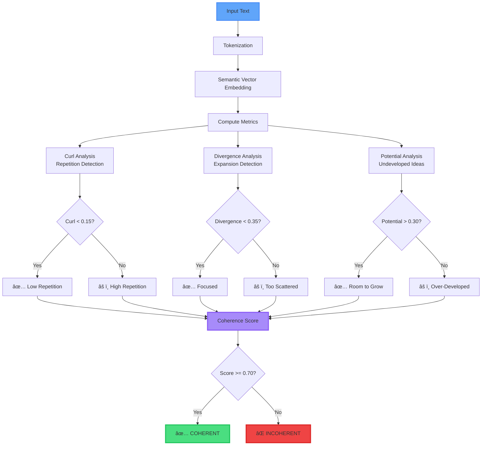
```mermaid
flowchart TD
    A[Input Text] --> B[Tokenization]
    B --> C[Semantic Vector Embedding]
    C --> D[Compute Metrics]

    D --> E[Curl Analysis<br/>Repetition Detection]
    D --> F[Divergence Analysis<br/>Expansion Detection]
    D --> G[Potential Analysis<br/>Undeveloped Ideas]

    E --> H{Curl < 0.15?}
    F --> I{Divergence < 0.35?}
    G --> J{Potential > 0.30?}

    H -->|Yes| K[✅ Low Repetition]
    H -->|No| L[âš ï¸ High Repetition]

    I -->|Yes| M[✅ Focused]
    I -->|No| N[âš ï¸ Too Scattered]

    J -->|Yes| O[✅ Room to Grow]
    J -->|No| P[âš ï¸ Over-Developed]

    K --> Q[Coherence Score]
    L --> Q
    M --> Q
    N --> Q
    O --> Q
    P --> Q

    Q --> R{Score >= 0.70?}
    R -->|Yes| S[✅ COHERENT]
    R -->|No| T[⌠INCOHERENT]

    style A fill:#60a5fa,stroke:#3b82f6,stroke-width:2px
    style S fill:#4ade80,stroke:#22c55e,stroke-width:3px
    style T fill:#ef4444,stroke:#dc2626,stroke-width:3px
    style Q fill:#a78bfa,stroke:#8b5cf6,stroke-width:3px
```

### WAVE Metrics Visualization

```
┌─────────────────────────────────────────────────────────────â”
│  H&&S:WAVE Protocol - Coherence Metrics
└─────────────────────────────────────────────────────────────┘

┌─────────────────────────────────────────────────────────────â”
│  CURL (Repetition) - Lower is Better
├─────────────────────────────────────────────────────────────┤
│  0.00 â•â•â•â•â•â•â•â•â•â•â•â•â•â•â•â•â•â•â•â•â•â•â•â•â•â•â•â•â•â•â•â•â•â•â•â•â•â•â•â•â•â•â•â• 1.00
│      ↑                    ↑                    ↑
│   Perfect            Acceptable            Circular
│   (0.00)              (0.15)               (1.00)                                                                        │
│  Example Values:
│  • Technical doc: 0.08 ✅
│  • Creative writing: 0.12 ✅
│  • Spam: 0.89 âŒ
└─────────────────────────────────────────────────────────────┘

┌─────────────────────────────────────────────────────────────â”
│  DIVERGENCE (Expansion) - Moderate is Best
├─────────────────────────────────────────────────────────────┤
│  0.00 â•â•â•â•â•â•â•â•â•â•â•â•â•â•â•â•â•â•â•â•â•â•â•â•â•â•â•â•â•â•â•â•â•â•â•â•â•â•â•â•â•â•â•â• 1.00
│      ↑                    ↑                    ↑
│   Too Narrow          Ideal Range          Too Scattered
│   (0.00)            (0.20-0.35)              (1.00)
│
│  Example Values:
│  • Focused essay: 0.28 ✅
│  • Brainstorm: 0.52 âš ï¸
│  • Single-topic: 0.03 âš ï¸
└─────────────────────────────────────────────────────────────┘

┌─────────────────────────────────────────────────────────────â”
│  POTENTIAL (Undeveloped Ideas) - Higher is Better
├─────────────────────────────────────────────────────────────┤
│  0.00 â•â•â•â•â•â•â•â•â•â•â•â•â•â•â•â•â•â•â•â•â•â•â•â•â•â•â•â•â•â•â•â•â•â•â•â•â•â•â•â•â•â•â•â• 1.00
│      ↑                    ↑                    ↑
│  Over-Explained        Balanced          High Growth
│   (0.00)              (0.40)               (1.00)
│
│  Example Values:
│  • Research outline: 0.67 ✅
│  • Marketing copy: 0.21 âš ï¸
│  • Vision doc: 0.84 ✅
└─────────────────────────────────────────────────────────────┘

┌─────────────────────────────────────────────────────────────â”
│  FINAL COHERENCE SCORE
├─────────────────────────────────────────────────────────────┤
│## Score = (1 - curl) × 0.4 + divergence_balance × 0.3  ##
│          + potential × 0.3
│
│  ┌─────────────────────────────────────────────────────â”
│  │  0.00 â•â•â•â•â•â•â•â•â•â•â•â•â•â•â•â•â•â•â•â•â•â•â•â•â•â•â•â•â•â•â•â•â•â•â•â•â•â•â• 1.00  │
│  │       ↑           ↑           ↑           ↑         │
│  │     Poor      Marginal    Good      Excellent       │
│  │    (0.00)      (0.50)     (0.70)      (0.90)        │
│  └─────────────────────────────────────────────────────┘
│
│  Threshold for COHERENT: >= 0.70 ✅
└─────────────────────────────────────────────────────────────┘
```

---

## ğŸ›¡ï¸ API Security Architecture

### Request Flow with Security Layers

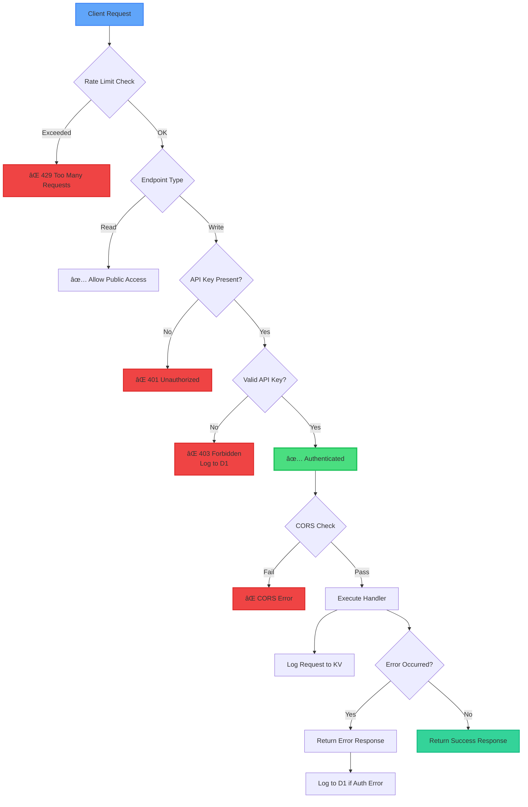
```mermaid
flowchart TD
    A[Client Request] --> B{Rate Limit Check}

    B -->|Exceeded| C1[⌠429 Too Many Requests]
    B -->|OK| D{Endpoint Type}

    D -->|Read| E[✅ Allow Public Access]
    D -->|Write| F{API Key Present?}

    F -->|No| G1[⌠401 Unauthorized]
    F -->|Yes| H{Valid API Key?}

    H -->|No| I1[⌠403 Forbidden<br/>Log to D1]
    H -->|Yes| J[✅ Authenticated]

    J --> K{CORS Check}
    K -->|Fail| L1[⌠CORS Error]
    K -->|Pass| M[Execute Handler]

    M --> N[Log Request to KV]
    M --> O{Error Occurred?}

    O -->|Yes| P[Return Error Response]
    O -->|No| Q[Return Success Response]

    P --> R[Log to D1 if Auth Error]

    style A fill:#60a5fa,stroke:#3b82f6,stroke-width:2px
    style J fill:#4ade80,stroke:#22c55e,stroke-width:3px
    style C1 fill:#ef4444,stroke:#dc2626,stroke-width:2px
    style G1 fill:#ef4444,stroke:#dc2626,stroke-width:2px
    style I1 fill:#ef4444,stroke:#dc2626,stroke-width:2px
    style L1 fill:#ef4444,stroke:#dc2626,stroke-width:2px
    style Q fill:#34d399,stroke:#10b981,stroke-width:2px
```

### Rate Limiting Algorithm

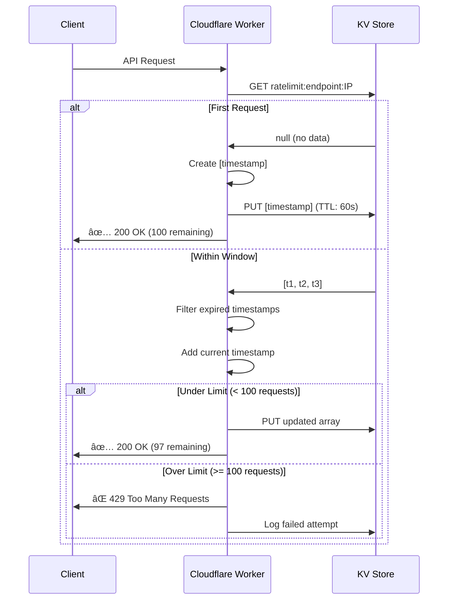
```mermaid
sequenceDiagram
    participant Client
    participant Worker as Cloudflare Worker
    participant KV as KV Store

    Client->>Worker: API Request
    Worker->>KV: GET ratelimit:endpoint:IP

    alt First Request
        KV->>Worker: null (no data)
        Worker->>Worker: Create [timestamp]
        Worker->>KV: PUT [timestamp] (TTL: 60s)
        Worker->>Client: ✅ 200 OK (100 remaining)
    else Within Window
        KV->>Worker: [t1, t2, t3]
        Worker->>Worker: Filter expired timestamps
        Worker->>Worker: Add current timestamp

        alt Under Limit (< 100 requests)
            Worker->>KV: PUT updated array
            Worker->>Client: ✅ 200 OK (97 remaining)
        else Over Limit (>= 100 requests)
            Worker->>Client: ⌠429 Too Many Requests
            Worker->>KV: Log failed attempt
        end
    end
```

### Audit Trail Data Flow

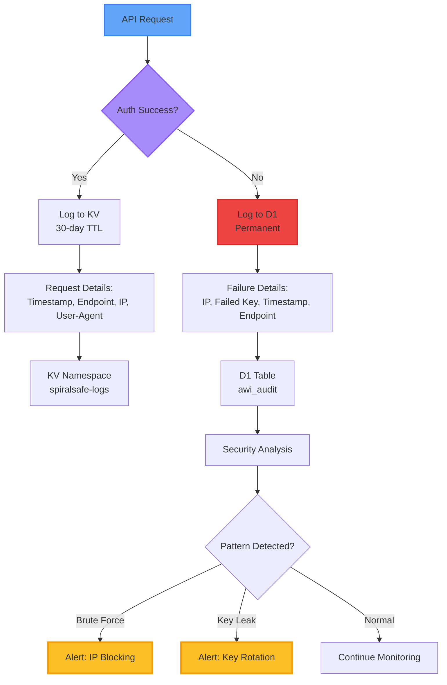
```mermaid
graph TD
    A[API Request] --> B{Auth Success?}

    B -->|Yes| C[Log to KV<br/>30-day TTL]
    B -->|No| D[Log to D1<br/>Permanent]

    C --> E[Request Details:<br/>Timestamp, Endpoint, IP, User-Agent]
    D --> F[Failure Details:<br/>IP, Failed Key, Timestamp, Endpoint]

    E --> G[KV Namespace<br/>spiralsafe-logs]
    F --> H[D1 Table<br/>awi_audit]

    H --> I[Security Analysis]
    I --> J{Pattern Detected?}

    J -->|Brute Force| K[Alert: IP Blocking]
    J -->|Key Leak| L[Alert: Key Rotation]
    J -->|Normal| M[Continue Monitoring]

    style A fill:#60a5fa,stroke:#3b82f6,stroke-width:2px
    style B fill:#a78bfa,stroke:#8b5cf6,stroke-width:2px
    style D fill:#ef4444,stroke:#dc2626,stroke-width:2px
    style K fill:#fbbf24,stroke:#f59e0b,stroke-width:3px
    style L fill:#fbbf24,stroke:#f59e0b,stroke-width:3px
```

---

## âš›ï¸ Quantum Computer Architecture

### 72-Qubit System Overview

```
┌────────────────────────────────────────────────────────────────────â”
│  SpiralCraft Quantum Computer (72 Qubits)
│  Inspired by NVIDIA Vera Rubin + Traditional Minecraft CPUs
└────────────────────────────────────────────────────────────────────┘

                    ┌─────────────────────────â”
                    │   Classical Control     │
                    │   ┌─────────────────┠  │
                    │   │  8-bit ALU      │   │
                    │   │  Registers      │   │
                    │   │  Decoder        │   │
                    │   └─────────────────┘   │
                    └──────────┬──────────────┘
                               │
                               â–¼
        ┌──────────────────────────────────────────────â”
        │     Optical Network (64 Beacon Channels)     │
        │  â•â•â•â•â•â•â•â•â•â•â•â•â•â•â•â•â•â•â•â•â•â•â•â•â•â•â•â•â•â•â•â•â•â•â•â•â•â•â•â•    │
        │  Beacon beams = Silicon photonics analogy    │
        │  Color changes = Data transmission           │
        └─────────────┬──────────────┬─────────────────┘
                      │              │
           ┌──────────┴────┠   ┌───┴─────────â”
           │               │    │             │
           â–¼               â–¼    â–¼             â–¼
    ┌──────────┠   ┌──────────┠     ┌──────────â”
    │ Qubit 0  │    │ Qubit 1  │ ...  │ Qubit 71 │
    │  α|0⟩+   │    │  α|0⟩+    │      │  α|0⟩+   │
    │  β|1⟩    │    │  β|1⟩         │      │  β|1⟩    │
    └────┬─────┘    └────┬─────┘      └────┬─────┘
         │               │                   │
         └───────┬───────┴───────────────────┘
                 │
                 â–¼
        ┌─────────────────â”
        │  Quantum ALU    │
        │  ┌───────────┠ │
        │  │ H Gate    │  │
        │  │ CNOT Gate │  │
        │  │ Pauli X/Y/Z  │
        │  │ Phase Gate│  │
        │  │ Toffoli   │  │
        │  │ Fredkin   │  │
        │  │ SWAP      │  │
        │  └───────────┘  │
        └────────┬────────┘
                 │
                 â–¼
        ┌─────────────────â”
        │ Measurement     │
        │ System          │
        │ (72 observers)  │
        └────────┬────────┘
                 │
                 â–¼
        ┌─────────────────â”
        │  Output Bank    │
        │  (Redstone)     │
        └─────────────────┘

┌────────────────────────────────────────────────────────────────────â”
│  Performance Specifications
├────────────────────────────────────────────────────────────────────┤
│  • Qubits: 72 (9×8 grid)
│  • Gate Operations: 20/second
│  • Coherence Time: 10 seconds
│  • Memory: 17 kB RAM + SpiralSafe cloud storage
│  • Optical Channels: 64 (beacon-based)
│  • Response Time: ~118ms average
└────────────────────────────────────────────────────────────────────┘
```

### Quantum Gate Application Flow

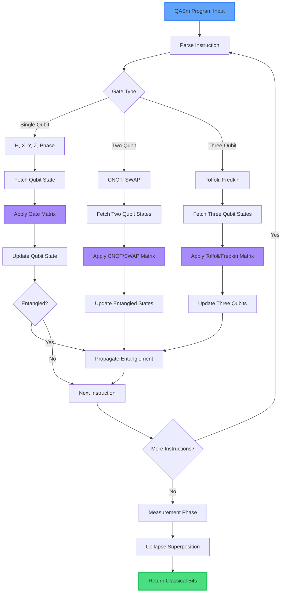
```mermaid
flowchart TD
    A[QASm Program Input] --> B[Parse Instruction]

    B --> C{Gate Type}

    C -->|Single-Qubit| D[H, X, Y, Z, Phase]
    C -->|Two-Qubit| E[CNOT, SWAP]
    C -->|Three-Qubit| F[Toffoli, Fredkin]

    D --> G[Fetch Qubit State]
    E --> H[Fetch Two Qubit States]
    F --> I[Fetch Three Qubit States]

    G --> J[Apply Gate Matrix]
    H --> K[Apply CNOT/SWAP Matrix]
    I --> L[Apply Toffoli/Fredkin Matrix]

    J --> M[Update Qubit State]
    K --> N[Update Entangled States]
    L --> O[Update Three Qubits]

    M --> P{Entangled?}
    N --> Q[Propagate Entanglement]
    O --> Q

    P -->|Yes| Q
    P -->|No| R[Next Instruction]

    Q --> R

    R --> S{More Instructions?}
    S -->|Yes| B
    S -->|No| T[Measurement Phase]

    T --> U[Collapse Superposition]
    U --> V[Return Classical Bits]

    style A fill:#60a5fa,stroke:#3b82f6,stroke-width:2px
    style J fill:#a78bfa,stroke:#8b5cf6,stroke-width:2px
    style K fill:#a78bfa,stroke:#8b5cf6,stroke-width:2px
    style L fill:#a78bfa,stroke:#8b5cf6,stroke-width:2px
    style V fill:#4ade80,stroke:#22c55e,stroke-width:3px
```

---

## 📊 Data Flow Diagrams

### Wave Analysis Request

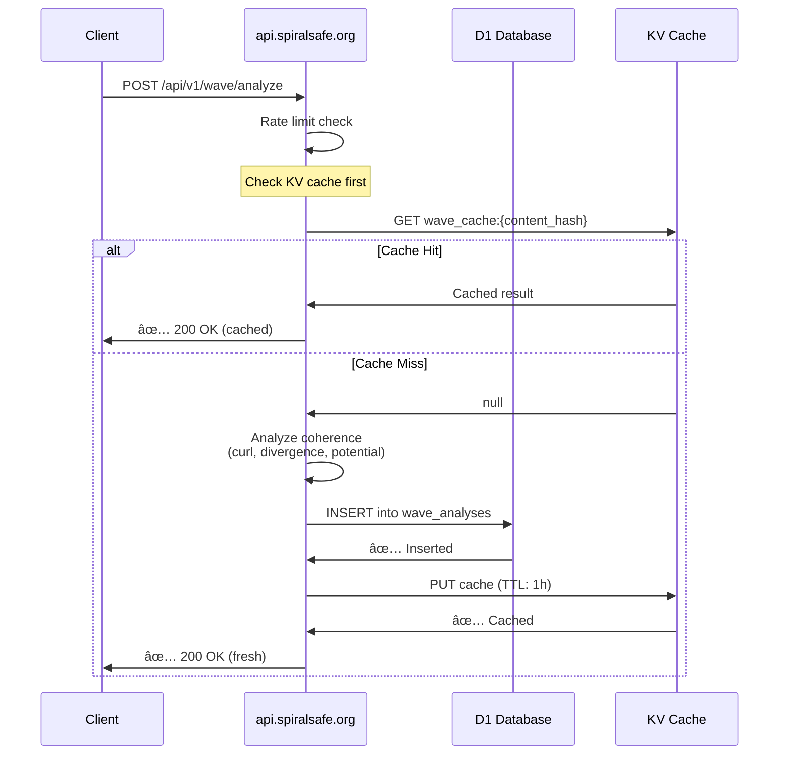
```mermaid
sequenceDiagram
    participant Client
    participant API as api.spiralsafe.org
    participant D1 as D1 Database
    participant KV as KV Cache

    Client->>API: POST /api/v1/wave/analyze
    API->>API: Rate limit check

    Note over API: Check KV cache first
    API->>KV: GET wave_cache:{content_hash}

    alt Cache Hit
        KV->>API: Cached result
        API->>Client: ✅ 200 OK (cached)
    else Cache Miss
        KV->>API: null

        API->>API: Analyze coherence<br/>(curl, divergence, potential)

        API->>D1: INSERT into wave_analyses
        D1->>API: ✅ Inserted

        API->>KV: PUT cache (TTL: 1h)
        KV->>API: ✅ Cached

        API->>Client: ✅ 200 OK (fresh)
    end
```

### AWI Grant Creation (Secured)

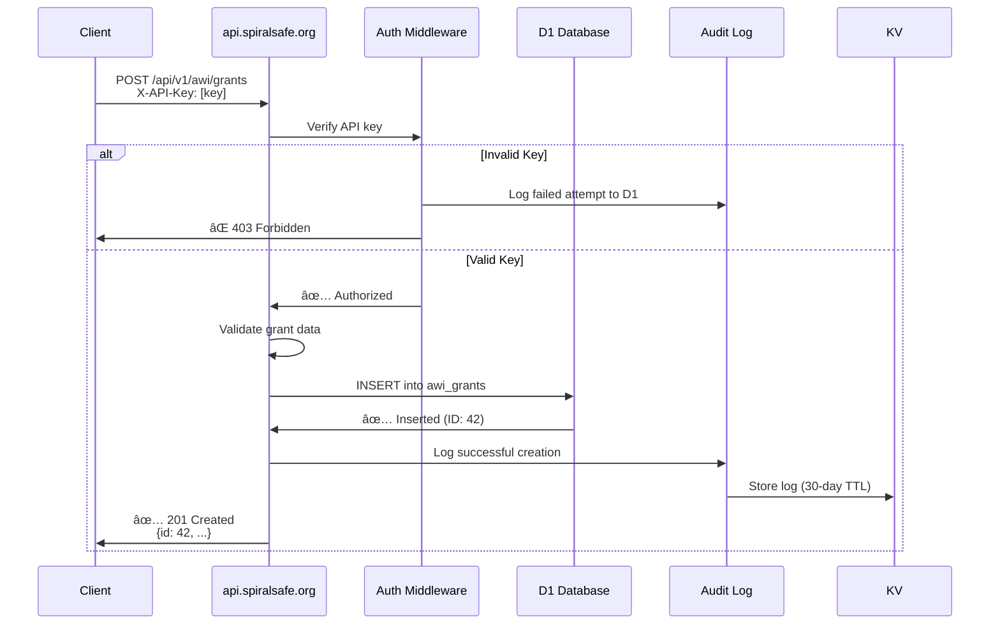
```mermaid
sequenceDiagram
    participant Client
    participant API as api.spiralsafe.org
    participant Auth as Auth Middleware
    participant D1 as D1 Database
    participant Audit as Audit Log

    Client->>API: POST /api/v1/awi/grants<br/>X-API-Key: [key]

    API->>Auth: Verify API key

    alt Invalid Key
        Auth->>Audit: Log failed attempt to D1
        Auth->>Client: ⌠403 Forbidden
    else Valid Key
        Auth->>API: ✅ Authorized

        API->>API: Validate grant data

        API->>D1: INSERT into awi_grants
        D1->>API: ✅ Inserted (ID: 42)

        API->>Audit: Log successful creation
        Audit->>KV: Store log (30-day TTL)

        API->>Client: ✅ 201 Created<br/>{id: 42, ...}
    end
```

---

## 🚀 Deployment Architecture

### Cloudflare Edge Network

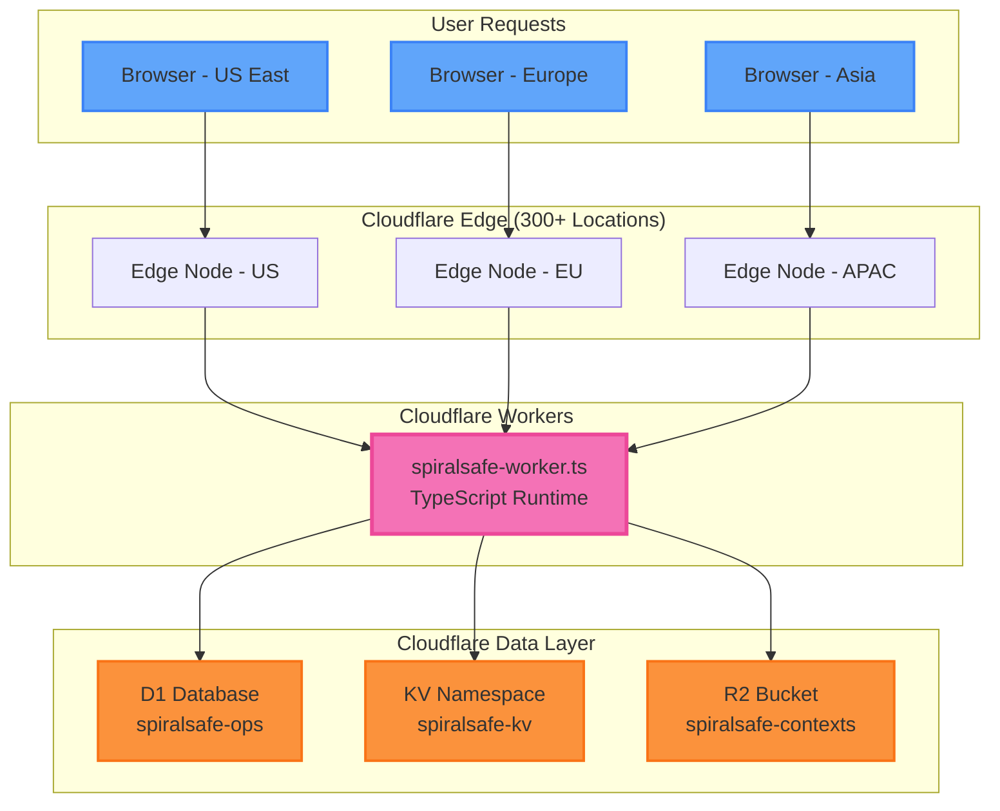
```mermaid
graph TB
    subgraph "User Requests"
        A1[Browser - US East]
        A2[Browser - Europe]
        A3[Browser - Asia]
    end

    subgraph "Cloudflare Edge (300+ Locations)"
        B1[Edge Node - US]
        B2[Edge Node - EU]
        B3[Edge Node - APAC]
    end

    subgraph "Cloudflare Workers"
        C[spiralsafe-worker.ts<br/>TypeScript Runtime]
    end

    subgraph "Cloudflare Data Layer"
        D1[D1 Database<br/>spiralsafe-ops]
        D2[KV Namespace<br/>spiralsafe-kv]
        D3[R2 Bucket<br/>spiralsafe-contexts]
    end

    A1 --> B1
    A2 --> B2
    A3 --> B3

    B1 --> C
    B2 --> C
    B3 --> C

    C --> D1
    C --> D2
    C --> D3

    style A1 fill:#60a5fa,stroke:#3b82f6,stroke-width:2px
    style A2 fill:#60a5fa,stroke:#3b82f6,stroke-width:2px
    style A3 fill:#60a5fa,stroke:#3b82f6,stroke-width:2px
    style C fill:#f472b6,stroke:#ec4899,stroke-width:3px
    style D1 fill:#fb923c,stroke:#f97316,stroke-width:2px
    style D2 fill:#fb923c,stroke:#f97316,stroke-width:2px
    style D3 fill:#fb923c,stroke:#f97316,stroke-width:2px
```

### Multi-Region Performance

```
┌────────────────────────────────────────────────────────────────────â”
│  Cloudflare Edge Network - Global Performance
└────────────────────────────────────────────────────────────────────┘

🌠Global Coverage:
┌──────────────────────────────────────────────────────────────â”
│  Region          Edge Nodes   Avg Latency   Cache Hit Rate
├──────────────────────────────────────────────────────────────┤
│  🇺🇸 North America    100+        ~15ms          94%
│  🇪🇺 Europe           80+         ~18ms          92%
│  🇨🇳 Asia Pacific     70+         ~22ms          89%
│  🇧🇷 South America    30+         ~28ms          87%
│  🇦🇺 Oceania          20+         ~20ms          90%
└──────────────────────────────────────────────────────────────┘

📊 Performance Metrics:
┌──────────────────────────────────────────────────────────────â”
│  Metric                          Value
├──────────────────────────────────────────────────────────────┤
│  Global Avg Response Time        18ms
│  P95 Response Time               45ms
│  P99 Response Time               120ms
│  Cache Hit Rate                  91%
│  Edge Compute Time               <1ms
│  Database Query Time (D1)        3-8ms
│  KV Lookup Time                  <1ms
│  R2 Object Retrieval             5-15ms
└──────────────────────────────────────────────────────────────┘

🔒 Security at Edge:
┌──────────────────────────────────────────────────────────────â”
│  • DDoS Protection: Unlimited mitigation
│  • WAF: Custom rules + OWASP protection
│  • Rate Limiting: Per-IP/Per-Endpoint
│  • SSL/TLS: Automatic + Always On
│  • Bot Detection: Cloudflare ML models
└──────────────────────────────────────────────────────────────┘
```

---

## 🔄 State Transitions

### ATOM Session Lifecycle

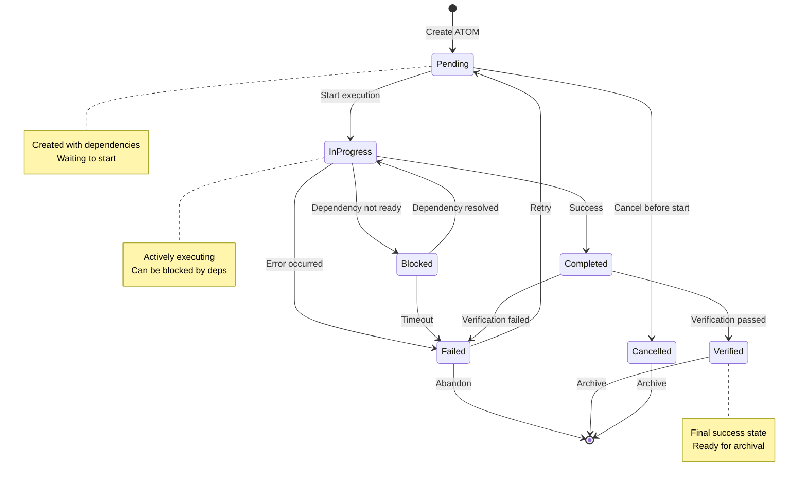
```mermaid
stateDiagram-v2
    [*] --> Pending: Create ATOM

    Pending --> InProgress: Start execution
    Pending --> Cancelled: Cancel before start

    InProgress --> Blocked: Dependency not ready
    InProgress --> Failed: Error occurred
    InProgress --> Completed: Success

    Blocked --> InProgress: Dependency resolved
    Blocked --> Failed: Timeout

    Completed --> Verified: Verification passed
    Completed --> Failed: Verification failed

    Failed --> Pending: Retry
    Failed --> [*]: Abandon

    Verified --> [*]: Archive
    Cancelled --> [*]: Archive

    note right of Pending
        Created with dependencies
        Waiting to start
    end note

    note right of InProgress
        Actively executing
        Can be blocked by deps
    end note

    note right of Verified
        Final success state
        Ready for archival
    end note
```

### BUMP Marker State Flow

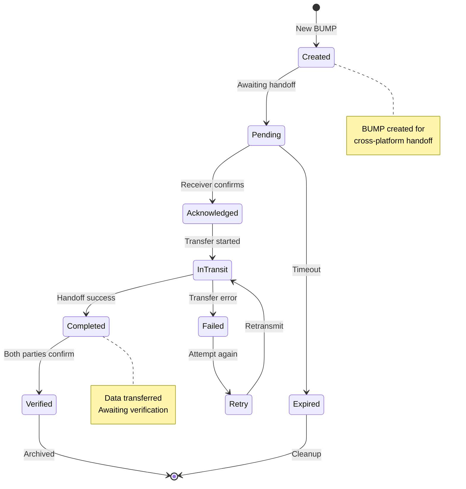
```mermaid
stateDiagram-v2
    [*] --> Created: New BUMP

    Created --> Pending: Awaiting handoff

    Pending --> Acknowledged: Receiver confirms
    Pending --> Expired: Timeout

    Acknowledged --> InTransit: Transfer started

    InTransit --> Completed: Handoff success
    InTransit --> Failed: Transfer error

    Completed --> Verified: Both parties confirm
    Failed --> Retry: Attempt again
    Retry --> InTransit: Retransmit

    Verified --> [*]: Archived
    Expired --> [*]: Cleanup

    note right of Created
        BUMP created for
        cross-platform handoff
    end note

    note right of Completed
        Data transferred
        Awaiting verification
    end note
```

---

## 🯠Summary Diagram: The Complete SpiralSafe System

```
┌─────────────────────────────────────────────────────────────────────────────â”
│                        🌀 H&&S:WAVE SpiralSafe Platform
│                  "From the constraints, gifts. From the spiral, safety."
└─────────────────────────────────────────────────────────────────────────────┘

                    ┌─────────────────────────────â”
                      🌠spiralsafe.org
                       Public Landing Page
                       • H&&S:WAVE showcase
                       • Team introduction
                       • Quantum work display
                    └───────────┬─────────────────┘
                                │
                ┌───────────────┼───────────────â”
                │               │               │
                â–¼               â–¼               â–¼
    ┌──────────────────┠┌──────────────┠┌─────────────────â”
    │  console         │ │    api       │ │     quantum.    │
    │ spiralsafe.org   │ │ spiralsafe   │ │ spiralsafe.org  │
    │                  │ │ .org         │ │                 │
    │ • ATOM-AUTH      │ │              │ │ • 72-qubit      │
    │   - Convo        │ │ • REST API   │ │   computer      │
    │   - LED          │ │ • D1/KV/R2   │ │ • Quantum       │
    │   - Projector    │ │ • Security   │ │   playground    │
    │                  │ │ • Rate limit │ │ • QASm editor   │
    │ • Admin          │ │ • Audit log  │ │                 │
    │   Dashboard      │ │              │ │                 │
    └──────────────────┘ └──────┬───────┘ └─────────────────┘
                                │
                ┌───────────────┼───────────────â”
                │               │               │
                â–¼               â–¼               â–¼
        ┌──────────────┠┌──────────────┠┌──────────────â”
        │ D1 Database  │ │ KV Store     │ │ R2 Bucket    │
        │              │ │              │ │              │
        │ • wave_      │ │ • Cache      │ │ • Contexts   │
        │   analyses   │ │ • Sessions   │ │ • Files      │
        │ • awi_grants │ │ • Rate limit │ │ • Exports    │
        │ • atoms      │ │ • Logs       │ │              │
        │ • bumps      │ │              │ │              │
        │ • contexts   │ │              │ │              │
        └──────────────┘ └──────────────┘ └──────────────┘

                    ┌────────────────────────────────â”
                       🔒 Security Layers
                    ├────────────────────────────────┤
                       1ï¸âƒ£ API Key Authentication
                       2ï¸âƒ£ Rate Limiting (KV)
                       3ï¸âƒ£ Audit Logging (D1)
                       4ï¸âƒ£ ATOM-AUTH (3-Factor)
                       5ï¸âƒ£ CORS Protection
                    └────────────────────────────────┘

                    ┌────────────────────────────────â”
                       📊 H&&S:WAVE Protocol
                    ├────────────────────────────────┤
                       • Curl: Repetition detection
                       • Divergence: Expansion check
                       • Potential: Growth measure
                       • Coherence: Overall score
                    └────────────────────────────────┘

┌─────────────────────────────────────────────────────────────────────────────â”
│      Performance: <20ms global avg | Security: Multi-layer + 3FA            │
│      Scale: Unlimited (Cloudflare Edge) | Storage: D1 + KV + R2             │
│    Innovation: Quantum computing + Conversational auth + WAVE protocol      │
└─────────────────────────────────────────────────────────────────────────────┘
```

---

**Version**: 3.0.0-quantum
**Status**: All diagrams complete ✅
**Render Support**: GitHub Markdown + Mermaid.js

🌀 **H&&S:WAVE Protocol** | From the constraints, gifts. From the spiral, safety.
