# Quick Start Guide

═══════════════════════════════════════════════════════════════════════════
║ ║
║ ✦ THE SWIFT PATHS OF THE ROHIRRIM ✦ ║
║ ║
║ Get up and running in 2 minutes ⚡ ║
║ ║
║ 🐎 When speed is needed, the riders of Rohan answer ║
║ 🌳 When growth is sought, the White Tree provides ║
║ ✦ When hope is required, the Evenstar shines ║
║ ║
═══════════════════════════════════════════════════════════════════════════

**Get up and running in 2 minutes** ⚡

---

## For Coherence Engine Users (NEW) ⚡

**Want verification gates for your AI work?** Fastest path:

```bash
# 1. Load verification gates
source scripts/lib/verification-gate.sh

# 2. Check if you can work (is bump.md ready?)
gate_intention_to_execution
# ✓ Pass: Start coding
# ✗ Fail: Fill bump.md first (no placeholders!)

# 3. Do your work
vim my_file.txt

# 4. Log your decision
./scripts/atom-track.sh FEATURE "added cool thing" "my_file.txt"

# 5. Verify it logged
gate_execution_to_learning && echo "✓ Logged!"

# 6. Ship it
git commit -am "$(cat .claude/last_atom): My change"
```

**Now:** Your work is verifiable, observable, auditable. Like engineering should be.

### Check System Health

```bash
# Gate pass rate
cat .atom-trail/gate-transitions.jsonl | \
  jq -r '.passed' | \
  awk '{t++; if($1=="true")p++} END {print "Pass rate:", p/t*100"%"}'

# Decision freshness
./scripts/update-freshness.sh

# Doc state markers
./scripts/validate-document-state.sh | grep "✓"
```

---

## For New Contributors (60 seconds)

```mermaid
graph LR
    Start([🐎 Begin]) --> Clone[1. Clone Repo]
    Clone --> Verify[2. Verify Setup]
    Verify --> Test[3. Test Scripts]
    Test --> ATOM[4. Create ATOM Tag]
    ATOM --> Ready([✦ Ready!])

    style Start fill:#c8e6c9
    style Ready fill:#fff9c4
```



```bash
# 1. Clone
git clone https://github.com/toolate28/SpiralSafe.git
cd SpiralSafe

# 2. Verify setup
./scripts/verify-environment.sh

# 3. Make scripts executable (if needed)
chmod +x scripts/*.sh

# 4. Test everything works
./scripts/test-scripts.sh

# 5. Create your first ATOM tag
./scripts/atom-track.sh TEST "my first test" "README.md"
cat .claude/last_atom
```

**✓ Ready!** Now read [CONTRIBUTING.md](CONTRIBUTING.md) for details.

---

## For Quick Changes (90 seconds)

```mermaid
graph TD
    Start([🌳 Begin Change]) --> Branch[Create Branch]
    Branch --> Edit[Make Changes]
    Edit --> ATOM[Create ATOM Tag]
    ATOM --> Test[Run Tests]
    Test --> Pass{Tests Pass?}
    Pass -->|No| Edit
    Pass -->|Yes| Commit[Commit with ATOM]
    Commit --> Push[Push & Create PR]
    Push --> Done([✦ PR Created!])

    style Start fill:#c8e6c9
    style Edit fill:#fff9c4
    style Done fill:#e1f5fe
```



```bash
# 1. Create branch
git checkout -b feature/my-change

# 2. Make your change
# ... edit files ...

# 3. Create ATOM tag
./scripts/atom-track.sh FEATURE "description of change" "file-changed.md"

# 4. Test
./scripts/test-scripts.sh        # If you changed scripts
./scripts/scan-secrets.sh         # Always run this

# 5. Commit with ATOM tag
ATOM_TAG=$(cat .claude/last_atom)
git add .
git commit -m "${ATOM_TAG}: Brief description"

# 6. Push and create PR
git push origin feature/my-change
gh pr create  # Or use GitHub web UI
```

**✓ PR created!** Wait for automated ATOM tag and reviews.

---

## For Explorers (2 minutes)

### Understand the structure:

```bash
# Key documents
cat README.md                              # Main overview
cat SAFE_SPIRAL_MASTER_INDEX.md          # Complete navigation
cat CONTRIBUTING.md                       # How to contribute

# Try the ATOM system
./scripts/atom-track.sh EXPLORE "learning the system" "docs"
./scripts/update-freshness.sh             # See freshness tracking
ls .atom-trail/decisions/                 # View decision history

# Check repository health
./scripts/test-scripts.sh                 # All scripts
./scripts/test-integration.sh             # Integration tests
./scripts/scan-secrets.sh                 # Security scan
```

**Next:** Explore [IMPLEMENTATION_SUMMARY.md](docs/reports/implementation/IMPLEMENTATION_SUMMARY.md)

---

## Common Tasks

### Create an Issue

```bash
# Via CLI
gh issue create --title "Bug: something broken" --body "Details..."

# Or use GitHub web UI and pick a template
# ATOM tags will be auto-generated!
```

### Ask Claude for Help

In any PR or issue:

```markdown
@claude please explain how ATOM tracking works
@claude review this PR for security issues
@claude suggest improvements for this code
```

### Run Full Test Suite

```bash
./scripts/test-scripts.sh          # Shell scripts
./scripts/test-powershell.sh       # PowerShell (if installed)
./scripts/test-integration.sh      # Integration tests
./scripts/lint-markdown.sh         # Markdown (if markdownlint installed)
./scripts/scan-secrets.sh          # Security
./scripts/verify-environment.sh    # Environment
```

### Update Documentation

```bash
# 1. Edit the doc
vim SOME_DOC.md

# 2. Create ATOM tag
# For a specific file:
./scripts/atom-track.sh DOC "updated SOME_DOC" "SOME_DOC.md"
# Or for an issue (multiple formats supported):
./scripts/atom-track.sh DOC "updated docs for issue" "issue-#123"
./scripts/atom-track.sh DOC "updated docs for issue" "#123"
./scripts/atom-track.sh DOC "updated docs for issue" "issue-789"
./scripts/atom-track.sh DOC "updated docs for issue" "GH-456"

# 3. Lint (optional)
markdownlint SOME_DOC.md --fix

# 4. Commit
git commit -am "$(cat .claude/last_atom): Update SOME_DOC"
```

---

## Troubleshooting

**Something not working?** See [TROUBLESHOOTING.md](docs/guides/TROUBLESHOOTING.md)

**Quick fixes:**

```bash
# Scripts not executable
chmod +x scripts/*.sh

# Missing directories
mkdir -p .atom-trail/{decisions,counters,bedrock}
mkdir -p .claude/logs

# Reset ATOM counters (if corrupted)
rm .atom-trail/counters/*.count

# Clean test environment
rm -rf /tmp/spiralsafe-*
```

---

## What's Next?

### Learn the Frameworks

- **ATOM** - Decision tracking → `scripts/atom-track.sh --help`
- **Five Principles** - See `README.md`
- **Safe Spiral** - Read `SAFE_SPIRAL_MASTER_INDEX.md`

### Explore Features

- **Claude Integration** - Try `@claude` in PRs
- **Automated Workflows** - Check `.github/workflows/`
- **Security** - Read `.github/SECRETS.md`
- **Rulesets** - See `.github/RULESETS.md`

### Make an Impact

1. Pick an issue labeled `good-first-issue`
2. Read the issue template
3. Follow the contribution workflow
4. Get automated review from Claude
5. Merge and celebrate! 🎉

---

## The Philosophy (30 seconds)

Safe Spiral is built on **Five Core Principles**:

1. **Visible State** - See what's happening (ATOM trail, git history)
2. **Clear Intent** - Know why (ATOM tags document decisions)
3. **Natural Decomposition** - Work breaks at real boundaries
4. **Networked Learning** - Knowledge improves through sharing
5. **Measurable Delivery** - You can tell if it worked

Every contribution should align with these principles.

---

## Get Help

- **Issues:** https://github.com/toolate28/SpiralSafe/issues
- **Discussions:** https://github.com/toolate28/SpiralSafe/discussions
- **Docs:** Start with [README.md](README.md)
- **Claude:** Use `@claude` in PRs for AI assistance

---

**That's it!** You're ready to contribute.

_Information enriches through relay_ 🌀

═══════════════════════════════════════════════════════════════════════════
║ ║
║ ✦ THE EVENING STAR LIGHTS YOUR PATH ✦ ║
║ ║
║ You have taken the first steps on the spiral path. ║
║ May your journey be swift as the riders of Rohan, ║
║ May your work endure like the White Tree of Gondor, ║
║ May your contributions shine like the Evenstar above. ║
║ ║
║ Step True · Trust Deep · Pass Forward ║
║ ║
═══════════════════════════════════════════════════════════════════════════

---

**ATOM:** ATOM-DOC-20260102-009-quick-start-guide  
**Last Updated:** 2026-01-02

══════════════════════════════════════════════════════════════
✦ Gil-Estel, the Star of High Hope ✦
🌳 Telperion and Laurelin, Trees of Light 🌳
🐎 Shadowfax, swiftest of steeds 🐎
══════════════════════════════════════════════════════════════
