# Security Policy

═══════════════════════════════════════════════════════════════════════════
║ ║
║ 🛡️ THE SHIELDS OF THE CITADEL - SECURITY POLICY 🛡️ ║
║ ║
║ As the guards of Minas Tirith stood vigilant at their posts, ║
║ So we maintain vigilance over the security of this realm. ║
║ ║
║ 🌳 Deep roots are not reached by the frost ║
║ 🐎 Swift response when danger threatens ║
║ ✦ Clear guidance lights the way to safety ║
║ ║
═══════════════════════════════════════════════════════════════════════════

## Supported Versions

| Version | Supported          | Status                        |
| ------- | ------------------ | ----------------------------- |
| 1.0.x   | :white_check_mark: | 🌳 Current - Fully Supported  |
| < 1.0   | :x:                | 📜 Historical - Not Supported |

## Reporting a Vulnerability

**Please do not report security vulnerabilities through public GitHub issues.**

### Where to Report

Report security vulnerabilities to:

- **Email:** security@safespiral.org (or directly to @toolate28 via GitHub)
- **GitHub:** Use the [Security Advisories](https://github.com/toolate28/SpiralSafe/security/advisories/new) feature

### What to Include

Please include:

1. **Description** of the vulnerability
2. **Steps to reproduce** (or proof of concept)
3. **Potential impact** assessment
4. **Suggested fix** (if you have one)
5. **ATOM tag** (if you've created one tracking this)

### Response Timeline

```mermaid
graph TD
    Report([🔔 Report Received]) --> Initial[Initial Response<br/>48 hours]
    Initial --> Assess[Assessment<br/>1 week]
    Assess --> Severity{Severity?}

    Severity -->|Critical| C[Fix: 1-3 days]
    Severity -->|High| H[Fix: 1-2 weeks]
    Severity -->|Medium| M[Fix: 2-4 weeks]
    Severity -->|Low| L[Fix: Next cycle]

    C --> Release([🛡️ Security Patch])
    H --> Release
    M --> Release
    L --> Release

    style Report fill:#ffccbc
    style Release fill:#c8e6c9
```



- **Initial Response:** Within 48 hours
- **Assessment:** Within 1 week
- **Fix Development:** Depends on severity
  - Critical: 1-3 days
  - High: 1-2 weeks
  - Medium: 2-4 weeks
  - Low: Next release cycle

### Security Update Process

1. **Report received** → ATOM tag created (ATOM-SECURITY-YYYYMMDD-NNN)
2. **Assessment** → Severity classification (Critical/High/Medium/Low)
3. **Fix developed** → In private branch
4. **Testing** → Comprehensive security testing
5. **Disclosure** → Coordinated disclosure with reporter
6. **Release** → Security patch released
7. **Announcement** → Public disclosure after fix deployed

## Security Best Practices

### For Contributors

When contributing to SpiralSafe:

1. **Never commit secrets**
   - Run `./scripts/scan-secrets.sh` before each commit
   - Use environment variables for sensitive data
   - See `.github/SECRETS.md` for details

2. **Validate input**
   - Sanitize all user input
   - Validate file paths (prevent path traversal)
   - Check command injection vectors

3. **Follow principle of least privilege**
   - Scripts should not require `sudo` unless absolutely necessary
   - Document required permissions explicitly
   - Use capability-based security where possible

4. **Log security-relevant actions**
   - Use ATOM trail for security decisions
   - Log access to sensitive operations
   - Redact sensitive data in logs

### For Users

When using SpiralSafe:

1. **Keep dependencies updated**

   ```bash
   # Check for updates regularly
   git pull
   ```

2. **Verify scripts before execution**

   ```bash
   # Review script content
   cat scripts/script-name.sh

   # Check for shellcheck issues
   shellcheck scripts/script-name.sh
   ```

3. **Use secrets management**
   - Never hard-code credentials
   - Use `.env` files (in .gitignore)
   - Use GitHub Secrets for CI/CD

4. **Run security scans**

   ```bash
   # Scan for secrets
   ./scripts/scan-secrets.sh

   # Verify environment
   ./scripts/verify-environment.sh
   ```

## Known Security Considerations

### Script Execution

**Risk:** Scripts execute with user permissions
**Mitigation:**

- All scripts are versioned in git (audit trail)
- Scripts use `set -euo pipefail` for safety
- Scripts validate inputs before processing
- ATOM trail logs all execution decisions

### CI/CD Security

**Risk:** Workflow files can execute arbitrary code
**Mitigation:**

- Branch protection on main/develop
- Required reviews for workflow changes
- Secrets accessed only in protected environments
- Audit logs for all secret access

### Dependency Security

**Risk:** Shell scripts may call external tools
**Mitigation:**

- Scripts check for tool availability gracefully
- Minimal external dependencies
- Document all required tools
- Use package manager verification

### ATOM Trail Integrity

**Risk:** ATOM trail could be manipulated
**Mitigation:**

- ATOM trail is versioned in git
- Timestamps are in UTC (audit trail)
- Counters prevent sequence manipulation
- Freshness tracking detects anomalies

## Security Scanning

### Automated Scans

The repository includes automated security scanning:

1. **Secrets Scanning**

   ```bash
   ./scripts/scan-secrets.sh
   ```

   - Runs on every push
   - Detects common secret patterns
   - Prevents accidental exposure

2. **Code Quality**

   ```bash
   ./scripts/test-scripts.sh
   ```

   - Shellcheck validation
   - Syntax checking
   - Style compliance

3. **CI/CD Security**
   - GitHub Actions security scanning
   - Dependency vulnerability checks
   - Workflow permission audits

### Manual Security Review

For security-sensitive changes:

1. **Create ATOM security tag**

   ```bash
   ./scripts/atom-track.sh SECURITY "Description of security change" "file"
   ```

2. **Document threat model**
   - What threats does this address?
   - What are the residual risks?
   - What are the mitigations?

3. **Include security testing**
   - Penetration testing results
   - Fuzzing results
   - Static analysis results

4. **Request security review**
   - Add `security-review` label
   - Tag security-focused reviewers
   - Wait for explicit approval

## Security Contacts

### Primary Contact

- **Maintainer:** @toolate28
- **Email:** security@safespiral.org (or via GitHub)

### Escalation

For critical security issues requiring immediate attention:

1. Use GitHub Security Advisories (private)
2. Email maintainer directly
3. Mark as "Critical - Security"

## Vulnerability Disclosure Policy

### Responsible Disclosure

We follow a **coordinated disclosure** model:

1. **Report received** (Day 0)
   - Acknowledge receipt within 48 hours
   - Create private ATOM security tag

2. **Assessment** (Days 1-7)
   - Reproduce vulnerability
   - Assess impact and severity
   - Determine fix timeline

3. **Fix Development** (Days 7-21, varies by severity)
   - Develop fix in private branch
   - Test thoroughly
   - Prepare security advisory

4. **Pre-Disclosure** (Day 21-28)
   - Notify reporter of fix timeline
   - Coordinate disclosure date
   - Prepare public advisory

5. **Public Disclosure** (Day 28+)
   - Release security patch
   - Publish advisory
   - Credit reporter (if desired)
   - Update security documentation

### Embargo Period

- **Minimum:** 28 days from initial report
- **Negotiable:** Based on severity and fix complexity
- **Maximum:** 90 days (unless actively exploited)

### Public Disclosure

After fix deployment:

- Security advisory published in GitHub
- ATOM tag made public
- CVE requested if applicable
- Reporter credited (unless anonymous requested)

## Security Hall of Fame

We recognize security researchers who help improve SpiralSafe:

| Researcher | Vulnerability | Severity | Date  | Reward |
| ---------- | ------------- | -------- | ----- | ------ |
| _TBD_      | _TBD_         | _TBD_    | _TBD_ | 🏆     |

_Note: Currently no bounty program, but we publicly recognize contributors._

## Security Checklist

### For New Features

- [ ] Threat model documented
- [ ] Input validation implemented
- [ ] Output sanitization implemented
- [ ] Error handling secure (no sensitive data leakage)
- [ ] Secrets management considered
- [ ] ATOM security tag created
- [ ] Security testing performed
- [ ] Documentation updated

### For Security Fixes

- [ ] ATOM-SECURITY tag created
- [ ] Vulnerability impact assessed
- [ ] Fix tested in isolation
- [ ] Regression tests added
- [ ] No new vulnerabilities introduced
- [ ] Backward compatibility maintained
- [ ] Security advisory drafted
- [ ] Coordinated disclosure timeline set

## References

- [OWASP Top 10](https://owasp.org/www-project-top-ten/)
- [CWE Top 25](https://cwe.mitre.org/top25/)
- [GitHub Security Best Practices](https://docs.github.com/en/code-security)
- [NIST Cybersecurity Framework](https://www.nist.gov/cyberframework)

## Compliance

SpiralSafe follows:

- **GDPR considerations** (no personal data collected)
- **MIT License** (security fixes freely distributable)
- **Responsible disclosure** (coordinated with reporters)

---

## Thank You

═══════════════════════════════════════════════════════════════════════════
║ ║
║ ✦ GRATITUDE TO THE GUARDIANS ✦ ║
║ ║
║ Security researchers who responsibly disclose vulnerabilities ║
║ help make the Safe Spiral ecosystem safer for everyone. ║
║ ║
║ Like the sentinels who watched from the White Tower, ║
║ Your vigilance protects all who dwell within these walls. ║
║ ║
║ 🌳 Your care helps our ecosystem grow strong ║
║ 🐎 Your swiftness helps us respond with speed ║
║ ✦ Your honesty helps us build lasting trust ║
║ ║
║ We appreciate your efforts and will work with you to ensure ║
║ a secure, coordinated disclosure process. ║
║ ║
═══════════════════════════════════════════════════════════════════════════

**Remember:** Security is not just about finding vulnerabilities - it's about building trust through transparency and collaboration.

> _"As the guards of Gondor stand their watch,_  
> _So we stand watch over the security of our community."_

---

**ATOM:** ATOM-DOC-20260102-006-security-policy  
**Last Updated:** 2026-01-02  
**Version:** 1.0.0

══════════════════════════════════════════════════════════════
🛡️ May your watch be vigilant
🌳 May your findings strengthen the realm
✦ May trust flourish through transparency

Step True · Trust Deep · Pass Forward
══════════════════════════════════════════════════════════════
