# Troubleshooting Guide

═══════════════════════════════════════════════════════════════════════════
║                                                                         ║
║          🐎 THE COUNSEL OF THE WISE - TROUBLESHOOTING 🐎                ║
║                                                                         ║
║    When paths grow dark and obstacles appear,                          ║
║    The Fellowship does not despair but seeks solutions.                ║
║                                                                         ║
║    🌳 Even the mightiest tree weathered storms to grow                 ║
║    ✦ Even the darkest night yields to the Evenstar                     ║
║                                                                         ║
═══════════════════════════════════════════════════════════════════════════

**ATOM:** ATOM-DOC-20260102-008-troubleshooting-guide  
**Quick Reference:** Common issues and solutions

---

## Quick Diagnosis

```mermaid
graph TD
    Issue([🔍 Problem Detected]) --> Diagnose[Run Diagnostics]
    Diagnose --> Verify[./scripts/verify-environment.sh]
    Diagnose --> Test[./scripts/test-scripts.sh]
    Diagnose --> ATOM[Check ATOM Trail]
    
    Verify --> Result{Issue Found?}
    Test --> Result
    ATOM --> Result
    
    Result -->|Yes| Fix[Apply Fix Below]
    Result -->|No| Escalate[Seek Further Help]
    
    Fix --> Retest[Test Again]
    Retest --> Success([✦ Resolved!])
    
    style Issue fill:#ffccbc
    style Success fill:#c8e6c9
```



```bash
# Run full diagnostic
./scripts/verify-environment.sh
./scripts/test-scripts.sh

# Check ATOM trail health
ls -la .atom-trail/decisions/
cat .claude/last_atom
```

---

## Common Issues

### 1. Script Fails: "Permission denied"

**Symptom:**
```
bash: ./scripts/script-name.sh: Permission denied
```

**Solution:**
```bash
chmod +x scripts/*.sh
# Or specific script:
chmod +x scripts/script-name.sh
```

**Prevention:** All scripts should be executable after clone. If not, run `chmod +x scripts/*.sh`.

---

### 2. Shellcheck Not Found

**Symptom:**
```
⚠ shellcheck not available (install recommended)
```

**Solution:**

**Ubuntu/Debian:**
```bash
sudo apt-get update && sudo apt-get install -y shellcheck
```

**macOS:**
```bash
brew install shellcheck
```

**Windows (WSL):**
```bash
sudo apt-get update && sudo apt-get install -y shellcheck
```

**Impact:** Non-critical. Scripts will run but won't be linted.

---

### 3. ATOM Tag Generation Fails

**Symptom:**
```
ERROR: Could not create ATOM tag
```

**Causes:**
1. `.atom-trail/` directory doesn't exist
2. Counter file corrupted
3. Date command issues

**Solution:**
```bash
# Recreate directories
mkdir -p .atom-trail/decisions
mkdir -p .atom-trail/counters
mkdir -p .atom-trail/bedrock

# Test tag generation
./scripts/atom-track.sh TEST "troubleshooting test" "test"

# Check result
cat .claude/last_atom
```

**Recovery:** If counters are corrupted, delete the counter file:
```bash
rm .atom-trail/counters/TYPE-YYYYMMDD.count
# Next run will start fresh
```

---

### 4. Freshness Update Hangs

**Symptom:**
```
update-freshness.sh appears stuck
```

**Causes:**
1. Too many decision files (>1000)
2. sed performance issues
3. Corrupted JSON

**Solution:**
```bash
# Check number of decisions
ls -1 .atom-trail/decisions/*.json | wc -l

# If >1000, run in batches (future improvement needed)

# Find corrupted JSON
for f in .atom-trail/decisions/*.json; do
  if ! python3 -c "import json; json.load(open('$f'))" 2>/dev/null; then
    echo "Corrupted: $f"
  fi
done
```

**Workaround:** Move old decisions to bedrock manually:
```bash
mv .atom-trail/decisions/ATOM-*-2025*.json .atom-trail/bedrock/
```

---

### 5. Secrets Scanner False Positives

**Symptom:**
```
⚠️ FOUND: Potential API Keys detected
./.github/SECRETS.md:61:API_KEY=example_key
```

**Explanation:** Documentation files contain examples. This is expected.

**Fix examples:**
```bash
# Add # nosecret comment
API_KEY=example_key  # nosecret

# Or mark as example
API_KEY=your_api_key_here  # Automatically excluded
```

**Real secrets:** If you find actual secrets, immediately:
1. Revoke the secret
2. Remove from git history
3. See `.github/SECRETS.md` for recovery

---

### 6. CI Workflow Fails

**Symptom:**
GitHub Actions workflow shows red X.

**Diagnosis:**
1. Go to Actions tab
2. Click failed workflow
3. Expand failed step

**Common causes:**

**Missing dependency:**
```yaml
# Add to workflow if missing:
- name: Install dependencies
  run: |
    npm install -g shellcheck markdownlint-cli
```

**Permission issues:**
```yaml
# Add required permissions:
permissions:
  contents: write
  pull-requests: write
```

**Script not executable:**
```bash
# In workflow:
chmod +x scripts/*.sh
```

---

### 7. PowerShell Script Issues

**Symptom:**
```
Bootstrap.ps1 fails on Windows/macOS
```

**Solutions:**

**Execution Policy (Windows):**
```powershell
Set-ExecutionPolicy -ExecutionPolicy RemoteSigned -Scope CurrentUser
```

**PowerShell version:**
```powershell
$PSVersionTable.PSVersion
# Need 5.1+ (Windows) or 7+ (cross-platform)
```

**Path issues:**
```powershell
# Use absolute paths
$ScriptDir = Split-Path -Parent $MyInvocation.MyCommand.Path
```

---

### 8. Markdown Linting Errors

**Symptom:**
```
✗ Some markdown files have issues
```

**Common issues:**

**Line length (MD013):**
Disabled in `.markdownlint.json` - ignore if you see this.

**Inline HTML (MD033):**
Disabled for README badges and diagrams.

**Fix real issues:**
```bash
# Install markdownlint
npm install -g markdownlint-cli

# Fix automatically
markdownlint --fix *.md

# Check specific file
markdownlint README.md
```

---

### 9. Git Workflow Issues

**Symptom:**
```
error: failed to push some refs
```

**Solutions:**

**Diverged branches:**
```bash
git fetch origin
git rebase origin/main
# Resolve conflicts
git push
```

**Protected branch:**
```
Can't push to main directly
```
Solution: Create PR instead.

---

### 10. Environment Verification Fails

**Symptom:**
```
ERROR: python3 not found
ERROR: .claude/logs not writable
```

**Solutions:**

**Missing Python:**
```bash
# Ubuntu/Debian
sudo apt-get install python3

# macOS
brew install python3
```

**Permission issues:**
```bash
# Fix permissions
chmod 755 .claude
chmod 755 .claude/logs

# Recreate if needed
rm -rf .claude/logs
mkdir -p .claude/logs
```

---

## Advanced Troubleshooting

### ATOM Trail Corruption

**Symptoms:**
- Counters out of sequence
- Missing decision files
- Duplicate ATOM tags

**Recovery:**

1. **Backup current state:**
```bash
cp -r .atom-trail .atom-trail.backup.$(date +%Y%m%d)
```

2. **Audit trail:**
```bash
# Check for duplicates
ls .atom-trail/decisions/ | sort | uniq -d

# Verify JSON integrity
for f in .atom-trail/decisions/*.json; do
  if ! python3 -c "import json; json.load(open('$f'))" 2>/dev/null; then
    echo "Bad: $f"
  fi
done
```

3. **Rebuild counters:**
```bash
# Remove corrupted counters
rm .atom-trail/counters/*.count

# Next tag will rebuild automatically
./scripts/atom-track.sh TEST "recovery test" "recovery"
```

---

### Script Hangs

**Diagnosis:**
```bash
# Run with debug
bash -x ./scripts/script-name.sh

# Check for infinite loops
ps aux | grep script-name
kill <PID>
```

**Common causes:**
- Waiting for input (stdin)
- Network timeout
- Large file processing

---

### Performance Issues

**Large repositories:**

**ATOM trail with >1000 decisions:**
```bash
# Current: update-freshness.sh processes all
# Workaround: Run less frequently
# Future: Batch processing needed
```

**Many markdown files:**
```bash
# Lint specific directories
markdownlint docs/*.md
# Not: markdownlint **/*.md
```

---

## Getting Help

### Self-Service

1. **Read documentation:**
   - `CONTRIBUTING.md` - Contribution workflow
   - `SECURITY.md` - Security issues
   - `.github/SECRETS.md` - Secrets management
   - `docs/reports/implementation/IMPLEMENTATION_SUMMARY.md` - System overview

2. **Search issues:**
   ```bash
   gh issue list --search "your error message"
   ```

3. **Check logs:**
   ```bash
   ls -la .claude/logs/
   cat .claude/logs/atom-trail.jsonl
   ```

### Community Support

1. **Open issue:**
   Use templates: Bug Report, Feature Request, Documentation, Task

2. **Ask Claude:**
   In PRs: `@claude <your question>`

3. **Discussion forum:**
   For general questions and best practices

---

## Emergency Procedures

### Secrets Exposed

See `.github/SECRETS.md` section "Accidentally Committed a Secret?"

1. Revoke immediately
2. Remove from history
3. Contact maintainers

### Broken Main Branch

1. Don't panic
2. Create issue with `critical` label
3. Revert commit if safe:
   ```bash
   git revert <commit-hash>
   ```
4. Contact maintainers

### Lost ATOM Trail

1. Check backups:
   ```bash
   ls .atom-trail.backup.*
   ```

2. Restore from backup:
   ```bash
   rm -rf .atom-trail
   cp -r .atom-trail.backup.YYYYMMDD .atom-trail
   ```

3. If no backup, rebuild from git history:
   ```bash
   git log --all --grep="ATOM-" --oneline
   # Manually recreate decision files
   ```

---

## Prevention

### Pre-commit Checklist

```mermaid
graph LR
    Start([🌳 Ready to Commit]) --> Test[1. Test Scripts]
    Test --> Scan[2. Scan Secrets]
    Scan --> Verify[3. Verify Environment]
    Verify --> ATOM[4. Create ATOM Tag]
    ATOM --> Commit[5. Commit Changes]
    Commit --> Done([✦ Complete!])
    
    style Start fill:#c8e6c9
    style Done fill:#fff9c4
```



```bash
# 1. Test
./scripts/test-scripts.sh

# 2. Scan secrets
./scripts/scan-secrets.sh

# 3. Verify environment
./scripts/verify-environment.sh

# 4. Create ATOM tag
./scripts/atom-track.sh TYPE "description" "file"

# 5. Commit
git commit -m "ATOM-TYPE-YYYYMMDD-NNN: description"
```

### Regular Maintenance

**Weekly:**
- Review open PRs
- Update ATOM freshness

**Monthly:**
- Clean stale branches
- Review ATOM trail metrics
- Update dependencies

══════════════════════════════════════════════════════════════
   🐎 Swift diagnosis, like the riders of Rohan
   🌳 Patient care, like the gardeners of Gondor
   ✦ Clear guidance, like the Evenstar above
   
   May your problems be swiftly solved
   May your code run true
   May your path be clear
══════════════════════════════════════════════════════════════

**Quarterly:**
- Backup ATOM trail
- Review and refine rulesets
- Update documentation

---

## Quick Reference Card

```bash
# Diagnosis
./scripts/verify-environment.sh           # Check setup
./scripts/test-scripts.sh                 # Test scripts
./scripts/scan-secrets.sh                 # Find secrets

# ATOM Operations
./scripts/atom-track.sh TYPE "desc" "file"  # Create tag
./scripts/update-freshness.sh              # Update ages
cat .claude/last_atom                      # Last tag

# Recovery
chmod +x scripts/*.sh                     # Fix permissions
mkdir -p .atom-trail/{decisions,counters,bedrock}  # Recreate dirs
rm .atom-trail/counters/*.count          # Reset counters

# Get Help
gh issue create --template bug_report.md
@claude <question>  # In PR comments
```

---

**Last Updated:** 2026-01-02  
**Maintained by:** @toolate28 and community  
**Feedback:** Open issue with `documentation` label
