# 🌌 SpiralSafe Ecosystem Map

> **Note:** This document provides a high-level visual overview of how the SpiralSafe components interact.

## 📡 The Communications Architecture

The SpiralSafe ecosystem relies on **Coherence**—the synchronization between documentation (Intent), code (Mechanism), and physical state (Reality).

```mermaid
graph TD
    subgraph "📚 The Library (Notebooks)"
        PB[Project Book<br>Task Tracking]
        CM[Constraint Math<br>Theory & Proofs]
        GV[Git Insights<br>Health Analytics]
    end

    subgraph "⚙️ Ops Core (API)"
        API[SpiralSafe API<br>Cloudflare Worker]
        D1[(D1 Database<br>State Storage)]
        Wave[Wave Engine<br>Coherence Checks]
        AWI[AWI<br>Permission Scaffolding]
    end

    subgraph "🌐 Constellation (External)"
        KENL[KENL Ecosystem<br>Observability]
        Redstone[Quantum Redstone<br>Circuit Logic]
        Toolkit[Wave Toolkit<br>Doc Tools]
    end

    subgraph "🌉 Bridges (Physical)"
        Holo[Hologram Bridge]
        Tartarus[Tartarus Bridge]
    end

    %% Flows
    PB -->|Updates Tasks| API
    CM -->|Validates Logic| Wave
    GV -->|Monitors| D1

    API -->|Logs State| D1
    API -->|Enforces| AWI
    Wave -->|Verifies| PB

    Holo <-->|Syncs State| API
    Tartarus <-->|Syncs State| API

    %% External Links
    KENL -.->|Observes| API
    Wave -.->|Uses| Toolkit
```

---

## 🔗 The Constellation

SpiralSafe interacts with several sister repositories. While we treat them as a unified whole, they are distinct entities.

| Constellation Star   | Role                         | Link Information                                                              |
| -------------------- | ---------------------------- | ----------------------------------------------------------------------------- |
| **KENL**             | Observability & Audit Trails | [See KENL Ecosystem](https://github.com/toolate28/kenl) (Reference)           |
| **Quantum Redstone** | Information Physics Logic    | [Quantum Redstone Repo](https://github.com/toolate28/quantum-redstone)        |
| **Wave Toolkit**     | Documentation Coherence      | [Wave Toolkit](https://github.com/toolate28/wave-toolkit)                     |
| **ClaudeNPC**        | Agent Integation             | [ClaudeNPC Server Suite](https://github.com/toolate28/ClaudeNPC-Server-Suite) |

> _Links above are placeholders to the `toolate28` organization. If these repos are private or local, these links serve as symbolic references._

---

## 🔄 Synchronization Mechanics

1.  **Notebooks as Interfaces**:
    - The `project-book.ipynb` isn't just a log; it's a control surface. Cells in the notebook can query the `API` to check task status or `Wave` coherence.
    - `git_vcs_insights.ipynb` pulls directly from the `D1` state (via API) to visualize repository health.

2.  **API as the Heart**:
    - The **SpiralSafe API** (in `/ops`) acts as the central nervous system.
    - It receives `H&&S:WAVE` signals from CI/CD.
    - It grants temporary permissions via **AWI** (Atomic Work Item) scaffolding.

3.  **Physical Bridges**:
    - Python scripts in `/bridges` (like `hologram-bridge.py`) poll the API.
    - When the "Coherence" level drops, the physical hologram changes color/state.

---

## ✍️ Ecosystem Signatures

- **Architect**: Human
- **Structural Engineer**: Claude
- **System Integrator**: Helix (Gemini)