# MCP Integration Guide
## Model Context Protocol for Safe Spiral

**ATOM:** ATOM-DOC-20260102-010-mcp-integration-guide  
**Quick Reference:** Essential MCP servers and configuration  
**Last Updated:** 2026-01-02

```
════════════════════════════════════════════════════════════════════════════════
         🔌
        ╱│╲
       ╱ │ ╲      MCP: Model Context Protocol
      ╱  ◉  ╲     
     ╱  ╱│╲  ╲    Connect AI agents to infrastructure
    ╱  ╱ │ ╲  ╲   
   ╱  ╱  ◉  ╲  ╲  Live data · Tools · Services · Integration
  ◉──◉───◉───◉──◉
════════════════════════════════════════════════════════════════════════════════
```

---

## What is MCP?

**Model Context Protocol (MCP)** is an open standard for connecting AI assistants to external data sources and tools. Think of it as a plugin system for AI - instead of the AI being limited to what it was trained on, it can dynamically access:

- Live repository data (code, issues, PRs)
- Diagram generation tools
- Database connections
- File systems
- APIs and web services

For Safe Spiral, MCP enables Claude Desktop and GitHub Copilot to interact directly with repository infrastructure.

### MCP Architecture Overview

```mermaid
%%{init: {'theme':'base', 'themeVariables': { 'primaryColor':'#4a9eff','primaryTextColor':'#000','primaryBorderColor':'#2563eb','lineColor':'#3b82f6','secondaryColor':'#34d399','tertiaryColor':'#fbbf24'}}}%%
graph LR
    AI[🤖 AI Assistant<br/>Claude/Copilot] --> MCP[🔌 MCP Protocol]
    
    MCP --> GitHub[📦 GitHub MCP<br/>Issues, PRs, Code]
    MCP --> Mermaid[📊 Mermaid MCP<br/>Diagrams]
    MCP --> FS[📁 Filesystem MCP<br/>Local Files]
    MCP --> Mem[💾 Memory MCP<br/>Key-Value Store]
    
    GitHub --> Repo[(🗄️ Repository<br/>Data)]
    Mermaid --> Diagrams[📈 Generated<br/>Diagrams]
    FS --> Files[📄 Project<br/>Files]
    Mem --> Storage[🗃️ Persistent<br/>Storage]
    
    style AI fill:#dbeafe,stroke:#2563eb,stroke-width:3px,color:#000
    style MCP fill:#bfdbfe,stroke:#3b82f6,stroke-width:4px,color:#000
    style GitHub fill:#d1fae5,stroke:#10b981,stroke-width:2px,color:#000
    style Mermaid fill:#d1fae5,stroke:#10b981,stroke-width:2px,color:#000
    style FS fill:#d1fae5,stroke:#10b981,stroke-width:2px,color:#000
    style Mem fill:#d1fae5,stroke:#10b981,stroke-width:2px,color:#000
    style Repo fill:#fef3c7,stroke:#eab308,stroke-width:2px,color:#000
    style Diagrams fill:#fef3c7,stroke:#eab308,stroke-width:2px,color:#000
    style Files fill:#fef3c7,stroke:#eab308,stroke-width:2px,color:#000
    style Storage fill:#fef3c7,stroke:#eab308,stroke-width:2px,color:#000
```



---

## Quick Reference: Essential MCP Servers

| Server | Purpose | Requirements | Security Level |
|--------|---------|--------------|----------------|
| **GitHub Official** | Repository management, code search, issue tracking | Docker, GitHub PAT | ⚠️ High - requires repo token |
| **Mermaid** | Generate diagrams from text descriptions | Node.js, npx | ✅ Low - no authentication |
| **Filesystem** | Read/write local files | Built-in | ⚠️ High - full file access |
| **Memory** | Persistent key-value storage | Built-in | ✅ Medium - sandboxed |

**Note:** Only GitHub and Mermaid are configured by default in Safe Spiral.

---

## Configuration Locations

### Claude Desktop

**macOS:**
```
~/Library/Application Support/Claude/claude_desktop_config.json
```

**Windows:**
```
%APPDATA%\Claude\claude_desktop_config.json
```

**Linux:**
```
~/.config/Claude/claude_desktop_config.json
```

### Safe Spiral Repository

```
.claude/mcp-servers.json
```

This file is the **source of truth** for MCP configuration in this repository. Copy its contents to your Claude Desktop config to enable MCP integration.

---

## Setup Instructions

### Step 1: Verify Prerequisites

```bash
# Check Docker is running
docker ps

# Check Node.js is installed
node --version
npx --version

# Verify GitHub token is set
echo $GITHUB_PERSONAL_ACCESS_TOKEN
```

### Step 2: Configure Claude Desktop

1. Open Claude Desktop configuration file (see paths above)
2. Copy contents from `.claude/mcp-servers.json`
3. Ensure `GITHUB_PERSONAL_ACCESS_TOKEN` is set in environment
4. Restart Claude Desktop

### Step 3: Test MCP Connection

Ask Claude:
```
"Can you list the recent issues in this repository?"
```

If Claude can access GitHub data, MCP is working.

### Step 4: Run Healthcheck

```bash
./scripts/check-mcp-health.sh
```

This validates:
- Docker availability
- Node.js/npx setup
- Environment variables
- MCP server connectivity

---

## Security Considerations

⚠️ **Read this before enabling MCP:** [../.claude/MCP_SECURITY_NOTES.md](../.claude/MCP_SECURITY_NOTES.md)

### Key Threats

1. **Tool Poisoning** - Malicious MCP servers masquerading as legitimate ones
2. **Cross-Tool Exfiltration** - Data leakage between MCP servers
3. **Prompt Injection** - Adversarial inputs via tool descriptions

### Mitigations

- ✅ Use official Docker images only (verify provenance)
- ✅ Store tokens in environment variables (never hardcode)
- ✅ Apply principle of least privilege (minimal token scopes)
- ✅ Regular security audits of MCP configuration
- ✅ Monitor for unusual AI behavior

### ATOM Trail Gap

**Known Limitation:** MCP invocations are **not currently captured in ATOM trail**.

This means:
- No audit log of MCP server calls
- No record of data passed to/from MCP servers
- Cannot reconstruct decision chains involving MCP

**Mitigation:** Manually document MCP usage in commit messages and ATOM tags until logging middleware is implemented.

---

## Available MCP Servers

### GitHub Official MCP

**Docker Image:** `mcp/github`

**Capabilities:**
- Repository browsing and search
- Issue and PR management
- Branch and commit operations
- Code review and comments

**Setup:**
```bash
# Set GitHub token
export GITHUB_PERSONAL_ACCESS_TOKEN="ghp_your_token_here"

# Test connection
docker run --rm -i -e GITHUB_PERSONAL_ACCESS_TOKEN mcp/github
```

**Token Permissions:**
- Minimum: `repo` (read-only)
- For PR creation: `repo` (full)
- For issue management: `repo`, `write:discussion`

### Mermaid MCP

**npm Package:** `@modelcontextprotocol/server-mermaid`

**Capabilities:**
- Generate flowcharts
- Create sequence diagrams
- Build entity-relationship diagrams
- Produce state diagrams

**Setup:**
```bash
# Test Mermaid MCP
npx -y @modelcontextprotocol/server-mermaid
```

**No authentication required** - purely local diagram generation.

---

## Troubleshooting

See [docs/TROUBLESHOOTING_MCP.md](./TROUBLESHOOTING_MCP.md) for MCP-specific issues.

### Quick Diagnostics

```bash
# Check MCP health
./scripts/check-mcp-health.sh

# Verify Docker
docker ps

# Test GitHub token
curl -H "Authorization: token $GITHUB_PERSONAL_ACCESS_TOKEN" \
  https://api.github.com/user

# Test npx
npx --version
```

### Common Issues

| Symptom | Cause | Fix |
|---------|-------|-----|
| "Docker not found" | Docker not running | Start Docker Desktop |
| "GITHUB_PERSONAL_ACCESS_TOKEN not set" | Missing env var | `export GITHUB_PERSONAL_ACCESS_TOKEN=...` |
| "Rate limit exceeded" | Too many API calls | Wait or use different token |
| "npx timeout" | Network/npm issues | Check internet, clear npm cache |

---

## Official Documentation

- **MCP Specification:** https://spec.modelcontextprotocol.io/
- **MCP GitHub:** https://github.com/modelcontextprotocol
- **Claude Desktop:** https://claude.ai/download
- **Safe Spiral Security Notes:** [../.claude/MCP_SECURITY_NOTES.md](../.claude/MCP_SECURITY_NOTES.md)

---

## Best Practices

### DO ✅

- Read security documentation before enabling MCP
- Use environment variables for all secrets
- Test MCP servers in isolation before production
- Document MCP usage in ATOM tags
- Regularly rotate API tokens
- Monitor AI behavior for anomalies

### DON'T ❌

- Hardcode tokens in configuration files
- Enable MCP servers you don't need
- Trust tool descriptions without verification
- Assume MCP is sandboxed by default
- Ignore ATOM trail gap
- Deploy without understanding data flows

---

## Integration with Safe Spiral Principles

MCP integration aligns with Safe Spiral's core principles:

1. **Visible State** - ⚠️ Partial (ATOM trail gap exists)
2. **Clear Intent** - ✅ Explicit configuration files
3. **Natural Decomposition** - ✅ Modular MCP servers
4. **Networked Learning** - ✅ AI-repository collaboration
5. **Measurable Delivery** - ✅ Healthcheck tooling

**Operating Principle:**  
Enable powerful capabilities while maintaining transparency about limitations. Acknowledge visibility gaps rather than pretending they don't exist.

---

## Contributing

Found an issue or have a suggestion? See [CONTRIBUTING.md](../CONTRIBUTING.md).

When working with MCP:
1. Create ATOM tag: `./scripts/atom-track.sh TASK "MCP-related work" "mcp"`
2. Document security implications
3. Test with `check-mcp-health.sh`
4. Update this guide if adding new servers

---

*Hope && Sauce*  
*Step True · Trust Deep · Pass Forward*

**ATOM:** ATOM-DOC-20260102-010-mcp-integration-guide  
**See Also:** MCP_SECURITY_NOTES.md, TROUBLESHOOTING_MCP.md
