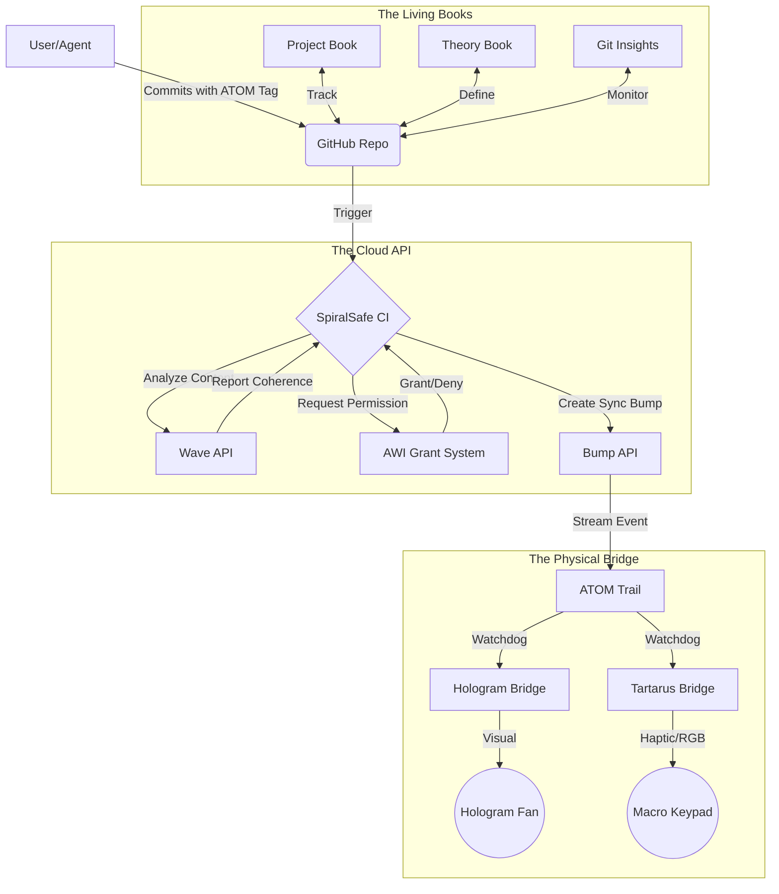

# 🌀 SpiralSafe System Overview

> *"From the constraints, gifts. From the spiral, safety."*

**SpiralSafe** is not just a repository; it is a **cyber-physical ecosystem** where code, documentation, and hardware exist in a verified state of coherence. This document explains the invisible architecture that keeps the system alive.

---

## 📡 1. The SpiralSafe API (`api.spiralsafe.org`)

The central nervous system. It doesn't just store data; it validates the *meaning* of our work.

| Endpoint            | Function                                                                                                                                                           | GitHub Flair |
| :------------------ | :----------------------------------------------------------------------------------------------------------------------------------------------------------------- | :----------- |
| `/api/wave/analyze` | **Coherence Detection**: Treats text as a vector field. Calculates "curl" (circular logic) and "divergence" (unresolved threads). Fails CI if docs are incoherent. | 🌊           |
| `/api/bump/create`  | **State Tracking**: Every significant event (commit, deploy, failure) is a "Bump". This creates an immutable timeline of the project's life.                       | 📈           |
| `/api/awi/request`  | **Permission Grants**: Agents (like Copilot) request short-lived, scoped tokens to perform dangerous actions (e.g., deployments).                                  | 🛡️           |

---

## 📚 2. The Living Books

We don't just write documentation; we write **executable artifacts**. All books live in the `books/` directory.

### 📘 [The Project Book](books/project-book.ipynb)
**The Heartbeat.**
- Tracks active `ATOM` tasks.
- Visualizes project velocity.
- The single source of truth for "What are we doing?"

### 📐 [Constraint Mathematics](books/CONSTRAINT_MATHEMATICS_v1.ipynb)
**The Theory.**
- Proofs of the Isomorphism Principle.
- Executable Python models of constraint physics.
- Where "Constraints as Gifts" is mathematically proven.

### 🔮 [Platform Vision](books/claude-platform.ipynb)
**The Future.**
- Architectural blueprints for what comes next.
- Interface designs for the "Hope&&Sauced" platform.

### 📊 [Git & VCS Insights](books/git_vcs_insights.ipynb)
**The Health.**
- Interactive analysis of branch hygiene.
- Commit pattern recognition (Human vs. AI).
- **New Feature**: Automatically detects "stale" branches.

---

## 🌉 3. The Bridges: Code to Light

How do we *feel* the code? The `bridges/` directory contains Python daemons that turn `ATOM` logs into physical reality.

| Bridge                 | Description                                           | Interaction & Feedback                                                                                                                                                 |
| :--------------------- | :---------------------------------------------------- | :--------------------------------------------------------------------------------------------------------------------------------------------------------------------- |
| **Hologram Bridge** 🌀 | Reads the `ATOM` trail in real-time.                  | **Visual**: Displays a 3D spinning spiral on a physical fan display. **Feedback**: Turns **RED** on CI failure, **GREEN** on success, **BLUE** during "Ultrathink". |
| **Tartarus Bridge** 🎹 | Maps repository state to a Razer Tartarus Pro keypad. | **Interact**: Keys light up based on available actions (e.g., "Deploy" key only lights up when CI passes). **Haptic**: Physical confirmation of digital events.     |

---

## 🔄 4. The Synchronization Protocol (H&&S)

We use **H&&S Markers** to keep the human, the AI, and the machine in sync.

| Marker             | Meaning                                                 | Usage                                                |
| :----------------- | :------------------------------------------------------ | :--------------------------------------------------- |
| **H&&S:WAVE** 👋   | "I am handing this off. Please check the coherence."    | Added to PR bodies when architectural changes occur. |
| **H&&S:ACK** ✅    | "I have received the state. I understand."              | API response when a Bump is processed.               |
| **H&&S:SYNC** 🔄   | "The documentation has been updated to match the code." | Automated commits by the CI system.                  |

---

### *Seamless. Flawless. Coherent.*
*~ Hope&&Sauced*
