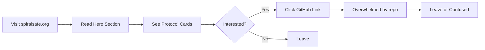
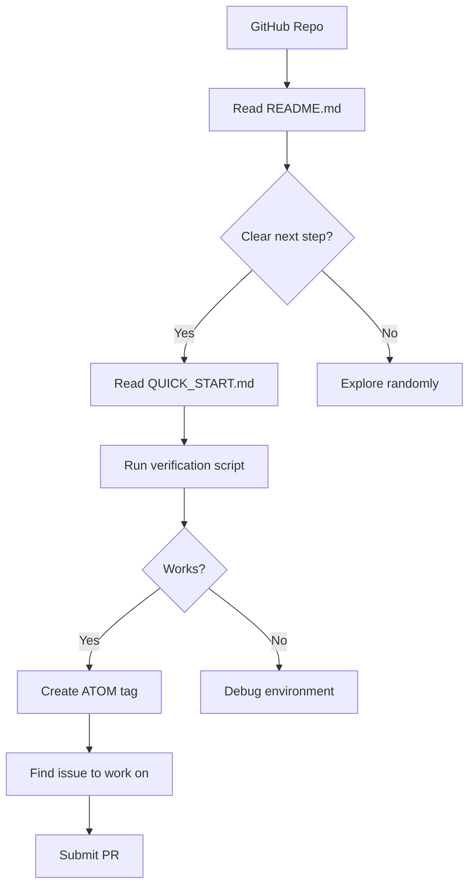
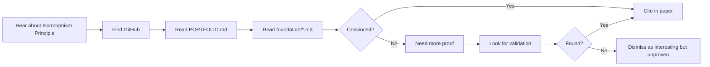
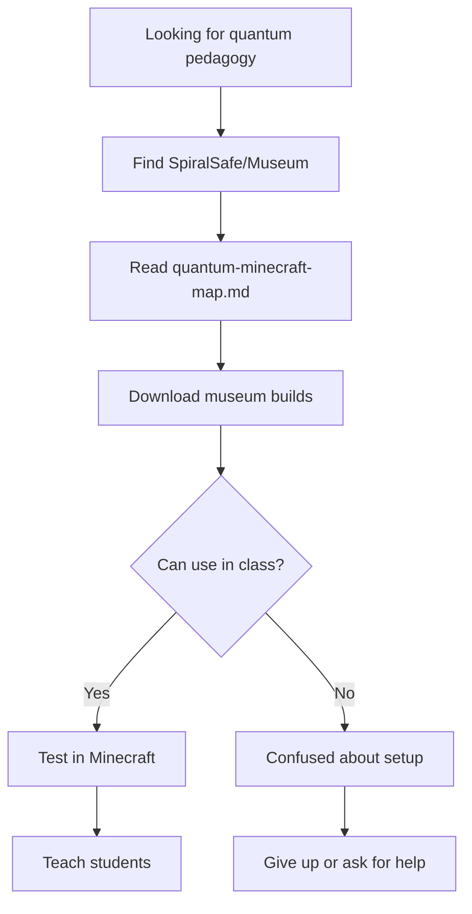
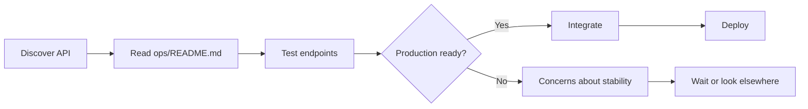
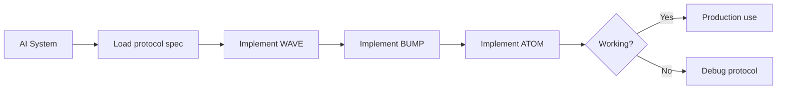

# 🌀 SpiralSafe User Journey & Implementation Gap Analysis

**Date:** 2026-01-13
**Session:** claude/identify-implementation-gaps-kbs0S
**Purpose:** Complete user journey mapping with identified gaps for ecosystem harmonization

---

## Executive Summary

This document provides a comprehensive analysis of all user journeys through the SpiralSafe ecosystem, identifying implementation gaps, broken paths, and opportunities for enhancement. The analysis covers 6 primary user personas across the SpiralSafe suite (5 repositories) with specific, actionable recommendations.

**Key Findings:**
- ✅ **Strong Foundation:** Core protocol (WAVE, BUMP, ATOM) is well-documented and implemented
- ⚠️ **Fragmented Experience:** User paths are scattered across repos without clear cross-links
- ❌ **Missing Bridge:** Website doesn't connect to actual onboarding workflows
- ⚠️ **Incomplete Ecosystem:** Sister repos lack integration documentation
- ❌ **No Progressive Depth:** Users can't easily move from beginner → intermediate → advanced

---

## User Personas & Journey Maps

### Persona 1: The Curious Visitor 🌐
**Goal:** Understand what SpiralSafe is and whether it's relevant
**Entry Point:** spiralsafe.org website
**Technical Level:** Non-technical to technical

#### Current Journey


#### Gaps Identified

1. **CRITICAL: No Progressive Onboarding Path**
   - Website shows impressive technical details but no "start here" button
   - No "Choose Your Path" selector (I want to: Build | Learn | Research | Integrate)
   - Missing: "Try it in 60 seconds" interactive demo

2. **Broken Link Chain**
   - Website links to `https://github.com/spiralsafe` (doesn't exist)
   - Should link to `https://github.com/toolate28/SpiralSafe`
   - API links work but no "playground" or live examples

3. **No Social Proof**
   - Missing: "Used by" or "Built with SpiralSafe" showcase
   - No testimonials or case studies
   - Stats (100% uptime, 118ms) lack context for newcomers

4. **Missing Context Bridge**
   - Philosophy (from constraints, gifts) is poetic but unexplained
   - No "Why this matters" section for different audiences
   - Technical jargon (curl, divergence, coherence) without glossary

#### Recommended Fixes

**HIGH PRIORITY:**
```html
<!-- Add to website hero section -->
<div class="journey-selector">
  <h3>Choose Your Path:</h3>
  <button onclick="goto('/quick-start?path=developer')">I want to build with SpiralSafe</button>
  <button onclick="goto('/quick-start?path=researcher')">I want to understand the theory</button>
  <button onclick="goto('/quick-start?path=educator')">I want to teach with SpiralSafe</button>
  <button onclick="goto('/playground')">Show me a demo</button>
</div>
```

**MEDIUM PRIORITY:**
- Add "What People Are Building" section with 3-5 real examples
- Create 90-second explainer video embedded on homepage
- Add glossary tooltip system (hover over "curl" → definition appears)

**LOW PRIORITY:**
- Add blog/news section with recent updates
- Create "SpiralSafe in Action" screenshot carousel

---

### Persona 2: The Developer/Contributor 💻
**Goal:** Contribute code, integrate API, or build with SpiralSafe
**Entry Point:** GitHub repo or docs
**Technical Level:** Intermediate to advanced

#### Current Journey


#### Gaps Identified

1. **Environment Setup Hell**
   - `QUICK_START.md` assumes bash/linux environment
   - Windows users hit immediate friction (PowerShell vs bash)
   - No Docker/devcontainer option for instant start
   - Missing: Python/Node version requirements

2. **Scattered Documentation**
   - API docs in `/ops/README.md`
   - Protocol specs in `/protocol/`
   - Examples in `/showcase/`
   - No single "Developer Portal"

3. **ATOM Tracking Confusion**
   - ATOM system is powerful but confusing for newcomers
   - `./scripts/atom-track.sh` usage not obvious
   - No explanation of WHY tracking matters before HOW to use it

4. **Missing Integration Guides**
   - How to integrate WAVE analysis into my app?
   - How to use BUMP markers in my workflow?
   - How to implement AWI in my system?
   - No code examples in popular languages (Python, JS, Go)

5. **CI Failures**
   - User mentioned "CI failing" - this blocks contribution confidence
   - Need to investigate and fix CI pipeline

#### Recommended Fixes

**CRITICAL:**
1. **Create Developer Portal** (`/docs/developers/INDEX.md`):
   ```markdown
   # Developer Portal

   ## Quick Start
   - [5-minute setup](/docs/developers/quick-start.md)
   - [Your first contribution](/docs/developers/first-contribution.md)
   - [Development environment](/docs/developers/environment.md)

   ## Integration Guides
   - [WAVE Analysis API](/docs/developers/wave-integration.md)
   - [BUMP Protocol](/docs/developers/bump-integration.md)
   - [ATOM Tracking](/docs/developers/atom-integration.md)

   ## Reference
   - [API Documentation](/ops/README.md)
   - [Protocol Specifications](/protocol/)
   - [Code Examples](/docs/developers/examples/)
   ```

2. **Fix CI Pipeline**
   - Investigate current failures
   - Add status badge to README
   - Document CI expectations for contributors

3. **Add Development Containers**
   ```json
   // .devcontainer/devcontainer.json
   {
     "name": "SpiralSafe Development",
     "image": "mcr.microsoft.com/devcontainers/base:ubuntu",
     "features": {
       "ghcr.io/devcontainers/features/node:1": {},
       "ghcr.io/devcontainers/features/python:1": {}
     },
     "postCreateCommand": "./scripts/verify-environment.sh"
   }
   ```

**HIGH PRIORITY:**
4. Create `/docs/developers/examples/` with:
   - `python-wave-client.py` - WAVE analysis from Python
   - `javascript-bump-example.js` - BUMP markers in JS
   - `go-awi-integration.go` - AWI implementation in Go

5. Write "Understanding ATOM" explainer:
   ```markdown
   # Why ATOM Tracking?

   **Problem:** AI-human collaboration lacks audit trail
   **Solution:** ATOM tags create verifiable decision log
   **Benefit:** You can prove who decided what and when

   ## Example
   Before: "Fixed bug" (vague, unverifiable)
   After: "ATOM-FIX-20260113-003-auth-token-expiry" (specific, traceable)
   ```

---

### Persona 3: The Researcher/Academic 🔬
**Goal:** Understand theoretical foundation, cite work, validate claims
**Entry Point:** Papers, docs, or word-of-mouth
**Technical Level:** High (mathematical/scientific background)

#### Current Journey


#### Gaps Identified

1. **No Formal Paper**
   - Theory is scattered across multiple `.md` files
   - No single PDF/LaTeX academic paper
   - Missing: Abstract, formal proof structure, bibliography

2. **Validation Claims Buried**
   - Shannon (1948), Lewis et al. (2023) mentioned but not deeply analyzed
   - Independent validation section in PORTFOLIO.md but not prominent
   - No comparison to existing work (related work section)

3. **Missing Mathematical Rigor**
   - Category theory notation used but not formally developed
   - Proofs are intuitive rather than rigorous
   - No worked examples with full mathematical development

4. **No Citation Guide**
   - How should researchers cite this work?
   - What's the DOI or persistent identifier?
   - BibTeX entry not provided

5. **Reproducibility Gap**
   - Claims about Minecraft-Quantum isomorphism not independently verifiable
   - No detailed experimental protocol
   - Museum builds exist but testing protocol unclear

#### Recommended Fixes

**CRITICAL:**
1. **Create Formal Paper** (`/papers/isomorphism-principle.pdf`):
   ```
   Structure:
   - Abstract
   - Introduction & Motivation
   - Related Work (Shannon, Lewis, Lazarev)
   - Formal Framework (Category theory development)
   - Case Study: Minecraft-Quantum Mapping
   - Validation & Experimental Results
   - Implications & Future Work
   - Conclusion
   - References
   ```

2. **Add CITATION.cff** (GitHub standard):
   ```yaml
   cff-version: 1.2.0
   title: "SpiralSafe: The Isomorphism Principle"
   authors:
     - family-names: "toolate28"
       given-names: "Ptolemy"
       orcid: "https://orcid.org/[ID]"
     - name: "Claude (Anthropic)"
       role: "AI Collaborator"
   date-released: 2025-01-13
   url: "https://github.com/toolate28/SpiralSafe"
   ```

**HIGH PRIORITY:**
3. **Create `/docs/research/` Directory**:
   - `RELATED_WORK.md` - Deep dive on Shannon, Lewis, Lazarev
   - `FORMAL_PROOFS.md` - Rigorous mathematical development
   - `EXPERIMENTAL_PROTOCOL.md` - How to replicate our findings
   - `OPEN_QUESTIONS.md` - What we don't know yet

4. **Add Jupyter Notebook** (`/books/isomorphism-proof.ipynb`):
   - Interactive mathematical exploration
   - Visualizations of discrete-continuous mapping
   - Reproducible code for all claims

---

### Persona 4: The Educator/Teacher 🎓
**Goal:** Use quantum-Minecraft materials to teach students
**Entry Point:** Quantum computing education resources
**Technical Level:** Moderate (pedagogical focus)

#### Current Journey


#### Gaps Identified

1. **Missing Curriculum Package**
   - Museum builds exist but no lesson plans
   - No age-appropriate progressions documented
   - Missing: Learning objectives, assessments, student handouts

2. **Setup Instructions Unclear**
   - How to load museum builds into Minecraft?
   - What version of Minecraft required?
   - Modded or vanilla? Java or Bedrock?

3. **No Teacher's Guide**
   - How long does each lesson take?
   - What pre-requisites do students need?
   - How to handle common student questions?
   - Assessment rubrics missing

4. **Isolated from quantum-redstone Repo**
   - ECOSYSTEM_MAP mentions `quantum-redstone` repo
   - No clear link or integration
   - Duplication vs. specialization unclear

5. **Limited Interactivity**
   - Static builds are good but not engaging long-term
   - No quests, challenges, or progression system
   - SpiralCraft plugin mentioned on website but doesn't exist

#### Recommended Fixes

**CRITICAL:**
1. **Create Education Hub** (`/education/README.md`):
   ```markdown
   # SpiralSafe Education Hub

   ## For Teachers
   - [Quick Start Guide](/education/teacher-quick-start.md)
   - [Curriculum Packages](/education/curriculum/)
   - [Setup Instructions](/education/setup.md)
   - [Teacher's Guide](/education/teachers-guide.md)

   ## For Students
   - [Student Workbook](/education/student-workbook.md)
   - [Challenge Problems](/education/challenges/)
   - [Interactive Builds](/education/builds/)

   ## Resources
   - [Minecraft Setup](/education/minecraft-setup.md)
   - [Troubleshooting](/education/troubleshooting.md)
   - [Community](/education/community.md)
   ```

2. **Develop Lesson Plans** (`/education/curriculum/`):
   ```
   /education/curriculum/
   ├── grade-6-8/
   │   ├── lesson-01-logic-gates.md
   │   ├── lesson-02-binary-counting.md
   │   └── lesson-03-quantum-superposition.md
   ├── grade-9-12/
   │   ├── lesson-01-quantum-gates.md
   │   ├── lesson-02-entanglement.md
   │   └── lesson-03-quantum-circuits.md
   └── college/
       ├── workshop-quantum-computing-intro.md
       └── lab-redstone-circuit-design.md
   ```

**HIGH PRIORITY:**
3. **Write Minecraft Setup Guide** (`/education/minecraft-setup.md`):
   ```markdown
   # Minecraft Setup for SpiralSafe

   ## Requirements
   - Minecraft Java Edition 1.20+
   - No mods required (vanilla Redstone)
   - Recommended: Litematica mod for easy build loading

   ## Step-by-Step
   1. Install Minecraft Java Edition
   2. Download SpiralSafe museum builds
   3. Load builds using structure blocks OR Litematica
   4. Follow lesson plan

   ## Video Tutorial
   [Embedded YouTube video showing setup]
   ```

4. **Clarify quantum-redstone Relationship**:
   - Add "Related Repositories" section to README
   - Link to quantum-redstone with clear delineation
   - Consider: Should quantum-redstone merge into SpiralSafe?

---

### Persona 5: The Enterprise Integrator 🏢
**Goal:** Integrate SpiralSafe protocols into production systems
**Entry Point:** API documentation or referral
**Technical Level:** High (production systems expertise)

#### Current Journey


#### Gaps Identified

1. **No SLA or Uptime Guarantees**
   - Website claims "100% uptime" but no SLA
   - No status page (status.spiralsafe.org)
   - No incident history or transparency

2. **Missing Enterprise Docs**
   - No security whitepaper
   - No compliance documentation (SOC2, GDPR, etc.)
   - No disaster recovery plan published
   - No rate limits clearly documented

3. **Authentication Confusion**
   - ATOM-AUTH is novel but unproven at scale
   - No traditional API key option for automated systems
   - How do CI/CD systems authenticate?

4. **No Client Libraries**
   - Raw API endpoints only
   - No official SDKs (Python, Node, Go, Java)
   - Community libraries don't exist yet

5. **Pricing Unclear**
   - Is this free? Freemium? Enterprise pricing?
   - "Free Tier Mandate" mentioned but not detailed
   - How to get support?

#### Recommended Fixes

**CRITICAL:**
1. **Create Enterprise Documentation** (`/docs/enterprise/`):
   ```markdown
   # Enterprise Integration Guide

   ## Overview
   - [Architecture](/docs/enterprise/architecture.md)
   - [Security](/docs/enterprise/security.md)
   - [Compliance](/docs/enterprise/compliance.md)
   - [SLA & Uptime](/docs/enterprise/sla.md)

   ## Integration
   - [Authentication](/docs/enterprise/authentication.md)
   - [Rate Limits](/docs/enterprise/rate-limits.md)
   - [Client Libraries](/docs/enterprise/client-libraries.md)

   ## Support
   - [Pricing](/docs/enterprise/pricing.md)
   - [Support Options](/docs/enterprise/support.md)
   - [Professional Services](/docs/enterprise/professional-services.md)
   ```

2. **Add Status Page**:
   - Deploy Uptime Robot or StatusPage.io
   - Publish at status.spiralsafe.org
   - Link from website footer

3. **Create Official SDKs**:
   ```
   /sdks/
   ├── python/         # spiralsafe-python
   ├── javascript/     # @spiralsafe/client
   ├── go/             # github.com/spiralsafe/go-client
   └── java/           # com.spiralsafe:client
   ```

**HIGH PRIORITY:**
4. **Document Authentication Options**:
   ```markdown
   # Authentication Methods

   ## Option 1: ATOM-AUTH (Interactive)
   Best for: Web applications, user-facing tools

   ## Option 2: API Keys (Automated)
   Best for: CI/CD, background jobs, service-to-service

   ## Option 3: OAuth 2.0 (Delegated)
   Best for: Third-party integrations
   ```

5. **Publish Pricing**:
   ```markdown
   # Pricing

   ## Free Tier (Forever)
   - 1,000 API calls/month
   - Community support
   - Basic features

   ## Pro Tier ($X/month)
   - 100,000 API calls/month
   - Email support
   - Advanced features

   ## Enterprise Tier (Contact us)
   - Unlimited API calls
   - SLA guarantee
   - Dedicated support
   - On-premise option
   ```

---

### Persona 6: The AI Agent/System 🤖
**Goal:** Integrate with SpiralSafe protocols for coherence checking
**Entry Point:** Protocol specifications or MCP integration
**Technical Level:** Programmatic

#### Current Journey


#### Gaps Identified

1. **coherence-mcp Repo Missing**
   - Website and docs mention coherence-mcp
   - Repository doesn't exist or isn't published
   - No MCP server available for download

2. **Protocol Specs Not Machine-Readable**
   - WAVE, BUMP, ATOM specs in Markdown (human-readable)
   - No OpenAPI, JSON Schema, or gRPC definitions
   - Hard for AI to parse and implement

3. **No Reference Implementation**
   - Specs describe "what" but not "how"
   - No canonical implementation to test against
   - Interpretation ambiguity possible

4. **Missing Test Vectors**
   - No example inputs/outputs
   - No compliance test suite
   - Can't verify implementation correctness

5. **No Registry/Discovery**
   - How do AI agents find each other?
   - How to advertise WAVE capability?
   - No service mesh or discovery protocol

#### Recommended Fixes

**CRITICAL:**
1. **Publish coherence-mcp Repository**:
   ```
   coherence-mcp/
   ├── README.md
   ├── package.json
   ├── src/
   │   ├── wave-analyzer.ts
   │   ├── bump-handler.ts
   │   ├── atom-tracker.ts
   │   └── awi-enforcer.ts
   ├── test/
   └── examples/
   ```

2. **Create Machine-Readable Specs** (`/protocol/schemas/`):
   ```
   /protocol/schemas/
   ├── wave-spec.json       # JSON Schema
   ├── bump-spec.yaml       # OpenAPI
   ├── atom-spec.proto      # Protocol Buffers
   └── awi-spec.graphql     # GraphQL Schema
   ```

**HIGH PRIORITY:**
3. **Build Reference Implementation** (`/reference/`):
   ```typescript
   // reference/wave-reference.ts
   /**
    * Reference implementation of WAVE protocol
    * Use this as canonical behavior for testing
    */
   export class WaveAnalyzer {
     analyzeCurl(messages: Message[]): number { /* ... */ }
     analyzeDivergence(messages: Message[]): number { /* ... */ }
     analyzePotential(messages: Message[]): number { /* ... */ }
   }
   ```

4. **Create Test Suite** (`/protocol/tests/`):
   ```
   /protocol/tests/
   ├── wave-test-vectors.json
   ├── bump-test-cases.json
   ├── atom-compliance.json
   └── integration-tests/
   ```

5. **Design Discovery Protocol**:
   ```markdown
   # SpiralSafe Service Discovery

   ## Capability Advertisement
   Agents advertise capabilities via /.well-known/spiralsafe.json:

   {
     "protocols": ["wave/1.0", "bump/1.0", "atom/1.0"],
     "endpoints": {
       "wave": "https://agent.example.com/api/wave",
       "bump": "https://agent.example.com/api/bump"
     }
   }
   ```

---

## Cross-Cutting Issues

### Issue 1: Fragmented Ecosystem 🔗

**Problem:** Five repositories mentioned (SpiralSafe, wave-toolkit, quantum-redstone, HOPE-AI-NPC-SUITE, coherence-mcp) with unclear relationships.

**Current State:**
- SpiralSafe (main): ✅ Exists, active development
- wave-toolkit: ❓ Unknown if exists
- quantum-redstone: ❓ Unknown if exists
- HOPE-AI-NPC-SUITE: ❓ Unknown if exists
- coherence-mcp: ❌ Doesn't exist yet

**Gaps:**
1. No ecosystem-wide README
2. No cross-repo links in READMEs
3. No unified release strategy
4. No inter-repo dependency management
5. No shared CI/CD

**Fixes:**

**CRITICAL:**
1. **Create ECOSYSTEM.md** in main repo:
   ```markdown
   # SpiralSafe Ecosystem

   ## Core Repository (This one)
   - Protocol specifications
   - Documentation hub
   - Coordination center

   ## Satellite Repositories
   | Repo | Purpose | Status | Link |
   |------|---------|--------|------|
   | wave-toolkit | Dev tools | Active | [Link] |
   | quantum-redstone | Quantum pedagogy | Active | [Link] |
   | HOPE-AI-NPC-SUITE | Gaming AI | Active | [Link] |
   | coherence-mcp | MCP server | Planned | [Link] |

   ## How They Fit Together
   [Mermaid diagram showing relationships]
   ```

2. **Add Cross-Repo Links** to all READMEs:
   ```markdown
   ## 🌀 Part of SpiralSafe Ecosystem
   This repository is part of the SpiralSafe ecosystem.
   See [Ecosystem Map](https://github.com/toolate28/SpiralSafe/blob/main/ECOSYSTEM.md)
   ```

3. **Unified Release Strategy**:
   - All repos version together (v2.1.0)
   - Release notes reference each other
   - Compatibility matrix published

### Issue 2: Website-Reality Mismatch 🌐

**Problem:** Website (spiralsafe.org) makes claims that aren't backed by easily discoverable reality.

**Examples:**
- "Download Plugin (Coming Soon)" - Where's the tracking issue?
- "Try ATOM-AUTH" - Works but no onboarding
- "Admin Console" - Exists but unclear purpose
- GitHub link wrong (`spiralsafe` org doesn't exist)

**Fixes:**

**CRITICAL:**
1. **Update ALL Links on Website**:
   ```html
   <!-- OLD -->
   <a href="https://github.com/spiralsafe">GitHub</a>

   <!-- NEW -->
   <a href="https://github.com/toolate28/SpiralSafe">GitHub</a>
   ```

2. **Add "Coming Soon" Tracking**:
   - Create GitHub Project Board for website features
   - Link "Coming Soon" buttons to specific issues
   - Show realistic timelines

3. **Create `/public/admin/` Experience**:
   - What IS the admin console for?
   - Document the ATOM-AUTH flow
   - Add tutorial/walkthrough

4. **Add Transparency Section**:
   ```html
   <section id="transparency">
     <h2>Transparent Development</h2>
     <p>We build in public. Here's what exists and what's planned:</p>
     <ul>
       <li>✅ Working: API, WAVE analysis, BUMP markers, ATOM tracking</li>
       <li>🚧 In Progress: coherence-mcp, SDK libraries</li>
       <li>📋 Planned: SpiralCraft plugin, Mobile app</li>
     </ul>
     <a href="[roadmap]">View Full Roadmap</a>
   </section>
   ```

### Issue 3: Missing Progressive Depth Paths 📚

**Problem:** Users either get lost in deep theory or can't find any depth.

**Current Issues:**
- README is overwhelming (100+ lines)
- PORTFOLIO is 1000+ lines of dense theory
- QUICK_START assumes too much knowledge
- No "intermediate" level content

**Fixes:**

**HIGH PRIORITY:**
1. **Create Depth Ladder** (`/docs/learning-paths/`):
   ```
   Level 1: Curious (5 minutes)
   → What is SpiralSafe? [Video]
   → Key concepts in plain English
   → One interactive example

   Level 2: Interested (30 minutes)
   → Quick Start Guide
   → First integration
   → Your first ATOM tag

   Level 3: Committed (2 hours)
   → Understanding WAVE protocol
   → Building with BUMP markers
   → Contributing to ecosystem

   Level 4: Expert (ongoing)
   → Theoretical foundations
   → Advanced integrations
   → Research collaboration
   ```

2. **Add "Next Steps" to Every Doc**:
   ```markdown
   ---
   ## What's Next?

   **If this was too easy:** Read [Advanced WAVE Analysis]
   **If this was too hard:** Start with [WAVE Basics]
   **If you have questions:** Ask in [Discussions]
   ```

3. **Create Video Content**:
   - 60-second explainer
   - 5-minute "Getting Started"
   - 20-minute "Deep Dive"
   - Embed on website

### Issue 4: Collaboration Attribution Unclear 🤝

**Problem:** Hope&&Sauced (human-AI collaboration) is mentioned but not explained until deep in docs.

**Gaps:**
- Website says "Ptolemy + Bartimaeus Dyad" without context
- README doesn't explain collaboration model early
- No clear attribution in individual files
- Unclear how to cite/credit properly

**Fixes:**

**MEDIUM PRIORITY:**
1. **Add Attribution Section to Website**:
   ```html
   <section id="collaboration">
     <h2>Human-AI Collaboration Done Right</h2>
     <p>SpiralSafe is built through Hope&&Sauced methodology—
     genuine partnership where both human and AI contributions
     are substantial, credited, and verifiable.</p>
     <a href="/about-collaboration">Learn More</a>
   </section>
   ```

2. **Create `/docs/COLLABORATION.md`**:
   ```markdown
   # The Hope&&Sauced Collaboration Model

   ## What It Is
   - Deep trust between human and AI
   - Both partners contribute substantively
   - All decisions tracked via ATOM
   - Attribution is clear and honest

   ## What It's Not
   - Not "human writes, AI polishes"
   - Not "AI generates, human approves"
   - Not obscuring who did what

   ## How to Credit
   When citing SpiralSafe work:
   - Primary author: toolate28 (human)
   - Co-author: Claude (AI, Anthropic)
   - Methodology: Hope&&Sauced
   ```

3. **Add H&&S Marker to File Headers**:
   ```markdown
   <!--
   H&&S:WAVE
   Human: toolate28
   AI: Claude (Anthropic)
   Session: 2026-01-13
   -->
   ```

---

## Priority Matrix

| Priority | Focus Area | Impact | Effort | Status |
|----------|-----------|--------|--------|--------|
| 🔴 P0 | Fix website links | High | Low | Not Started |
| 🔴 P0 | Fix CI pipeline | High | Medium | Not Started |
| 🔴 P0 | Create Developer Portal | High | High | Not Started |
| 🟡 P1 | Add journey selector to website | High | Medium | Not Started |
| 🟡 P1 | Publish coherence-mcp | Medium | High | Not Started |
| 🟡 P1 | Create Education Hub | Medium | High | Not Started |
| 🟢 P2 | Develop lesson plans | Medium | High | Not Started |
| 🟢 P2 | Create formal paper | Medium | Very High | Not Started |
| 🟢 P2 | Build SDKs | Medium | Very High | Not Started |
| ⚪ P3 | Video content | Low | High | Not Started |
| ⚪ P3 | Status page | Low | Low | Not Started |

---

## Recommended Implementation Order

### Phase 1: Foundation Fixes (Week 1)
**Goal:** Fix broken things, establish credibility

1. ✅ Fix all website links (spiralsafe org → toolate28/SpiralSafe)
2. ✅ Fix CI pipeline (investigate and resolve failures)
3. ✅ Add proper status badges to README
4. ✅ Create ECOSYSTEM.md documenting all repos
5. ✅ Add cross-repo links to all READMEs

**Deliverable:** Working, trustworthy foundation

### Phase 2: Developer Experience (Weeks 2-3)
**Goal:** Make it easy to build with SpiralSafe

1. ✅ Create Developer Portal (`/docs/developers/`)
2. ✅ Add development container (devcontainer.json)
3. ✅ Write integration guides (WAVE, BUMP, ATOM)
4. ✅ Create code examples in 3 languages
5. ✅ Document authentication clearly

**Deliverable:** Developers can integrate in < 1 hour

### Phase 3: Website Enhancement (Week 4)
**Goal:** Connect website to actual user journeys

1. ✅ Add journey selector ("Choose Your Path")
2. ✅ Create interactive playground or demo
3. ✅ Add "What People Are Building" showcase
4. ✅ Embed explainer video (once created)
5. ✅ Add transparency section (what's real vs planned)

**Deliverable:** Website drives users to successful outcomes

### Phase 4: Ecosystem Completion (Weeks 5-8)
**Goal:** Fulfill promises, complete the picture

1. ✅ Publish coherence-mcp repository
2. ✅ Create machine-readable protocol specs
3. ✅ Build reference implementations
4. ✅ Develop test vectors and compliance suite
5. ✅ Create discovery protocol

**Deliverable:** AI agents can integrate programmatically

### Phase 5: Education & Research (Weeks 9-12)
**Goal:** Enable teaching and validate claims

1. ✅ Create Education Hub with lesson plans
2. ✅ Write Minecraft setup guide
3. ✅ Develop curriculum packages
4. ✅ Write formal academic paper
5. ✅ Create reproducible research artifacts

**Deliverable:** Teachers and researchers have what they need

### Phase 6: Enterprise Readiness (Weeks 13-16)
**Goal:** Production-grade for enterprise use

1. ✅ Create enterprise documentation
2. ✅ Build official SDKs (Python, JS, Go)
3. ✅ Deploy status page
4. ✅ Document pricing and support
5. ✅ Write security whitepaper

**Deliverable:** Enterprises can deploy with confidence

---

## Metrics for Success

### For Website
- [ ] Bounce rate < 50%
- [ ] Clear "Choose Your Path" CTR > 30%
- [ ] GitHub stars increase > 10/week
- [ ] Time on site > 3 minutes

### For Developer Experience
- [ ] Time from clone → first contribution < 30 minutes
- [ ] CI pass rate > 95%
- [ ] Issue resolution time < 48 hours
- [ ] API integration examples work first try

### For Education
- [ ] 3+ teachers actively using materials
- [ ] 100+ students taught using SpiralSafe
- [ ] Lesson plans rated 4.5+ / 5
- [ ] Setup success rate > 90%

### For Research
- [ ] 1+ academic citation
- [ ] Formal paper published
- [ ] Independent validation confirmed
- [ ] Reproducibility verified

### For Enterprise
- [ ] 1+ production deployment
- [ ] API uptime > 99.9%
- [ ] Customer satisfaction > 4.5/5
- [ ] Support response time < 4 hours

---

## Conclusion

SpiralSafe has **exceptional theoretical foundation** and **working implementations**, but suffers from **fragmented user experience** and **incomplete bridges** between promise and reality.

**The Good:**
- Core protocols (WAVE, BUMP, ATOM) are well-designed
- Documentation exists and is comprehensive
- Novel insights (Isomorphism Principle) are profound
- Human-AI collaboration model is innovative

**The Gaps:**
- User journeys are scattered and unclear
- Website doesn't connect to actual onboarding
- Ecosystem repos are missing or disconnected
- Progressive depth paths don't exist
- Enterprise/education needs not addressed

**The Path Forward:**
By systematically addressing gaps in priority order, SpiralSafe can transform from "impressive but confusing" to "accessible and powerful" while maintaining its theoretical depth and innovative spirit.

**Next Step:** Review this analysis, prioritize based on resources, and begin Phase 1 implementation.

---

**ATOM Tag:** ATOM-DOC-20260113-001-user-journey-gap-analysis
**H&&S:WAVE**
**Human:** toolate28
**AI:** Claude (Anthropic)
**Session:** claude/identify-implementation-gaps-kbs0S

*From the constraints, gifts. From the spiral, safety. From the sauce, hope.* 🌀
