# 07. Failure Modes and Recovery

═══════════════════════════════════════════════════════════════════════════
║ ║
║ ⚔️ THE LESSONS OF BATTLE - FAILURE MODES & RECOVERY ⚔️ ║
║ ║
║ "The wise speak only of what they know. And you do not know ║
║ all the ways a thing may fail until you have seen it tested." ║
║ ║
║ Even the mightiest works face trials: ║
║ 🌳 The White Tree withered yet was renewed ║
║ 🐎 Rohan was besieged yet the riders came ║
║ ✦ The light was nearly lost yet the Evenstar endured ║
║ ║
║ So too must we understand how our systems may fail ║
║ And how they may be restored ║
║ ║
═══════════════════════════════════════════════════════════════════════════

**Or: What Breaks Safe Spiral and What to Do About It**

---

## Why This Matters

Safe Spiral is information-optimal, but **information can break in specific ways**. Understanding failure modes means:

```mermaid
graph TD
    Know[Understanding<br/>Failure Modes] --> Recog[🔍 Recognition<br/>See problems early]
    Know --> Recov[🛠️ Recovery<br/>Know how to fix]
    Know --> Resil[🛡️ Resilience<br/>Survive mistakes]
    Know --> Prev[🌳 Prevention<br/>Avoid failure]

    Recog --> Strong[Stronger Systems]
    Recov --> Strong
    Resil --> Strong
    Prev --> Strong

    style Know fill:#fff9c4
    style Strong fill:#c8e6c9
```

1. **Recognition:** You'll see problems early
2. **Recovery:** You'll know how to fix them
3. **Resilience:** You'll build systems that survive mistakes
4. **Prevention:** You'll structure things to avoid failure in the first place

This document catalogs every major failure mode we know about.

> _"Like the chronicles of battles past, these records serve those who come after."_

---

## Class 1: Safe Space Failures (Visible State Breaks)

### Failure 1.1: Stale Shared State (bump.md becomes obsolete)

**The Problem:**
bump.md was updated last week. Three new decisions happened since then. Two decisions in bump.md were reversed without updating the file. Now bump.md contradicts reality.

**Why It Happens:**

- Nobody owns updating bump.md (implicit assumption someone will)
- Updates to bump.md are slow/cumbersome (takes 10 minutes to add a decision)
- No enforcement (no one gets in trouble if bump.md is stale)
- Decision-makers bypass bump.md ("faster to just tell people")

**Detection:**

- ✓ Team members make decisions based on obsolete information
- ✓ Multiple versions of truth circulate ("I thought we decided X" vs "no, we changed that")
- ✓ People stop reading bump.md ("it's never updated anyway")
- ✓ Information flows through gossip instead of official channels

**Recovery:**

**Immediate (within hours):**

1. Do an audit: Compare bump.md to actual state
2. List all discrepancies
3. Update bump.md with current reality
4. Communicate: "bump.md is now accurate as of [timestamp]"

**Short-term (this week):**

1. Assign one person "bump.md ownership" (someone respected)
2. Establish update cadence: Every Monday + after major decisions
3. Link bump.md to decision trigger: "Decision happens → someone adds it to bump.md → linked in status chat"
4. Set 24-hour update timeout: Decisions go into bump.md within 24 hours or get flagged

**Long-term (ongoing):**

1. Make bump.md visible in team rituals (daily standup: "anything new in bump.md?")
2. Measure staleness: Track "days since last update" and alert at 5+ days
3. Automate where possible: Use git history, decision logs, structured data
4. Rotate ownership: Don't let one person become a bottleneck

**Prevention:**

- Make updates fast (one-minute process, not 10 minutes)
- Require link before making decision ("link to bump.md section or your decision doesn't count")
- Measure compliance ("what % of decisions appear in bump.md within 24 hours?")
- Make staleness visible (include "last updated X days ago" at top of file)

---

### Failure 1.2: Incomplete Shared State (Missing Categories)

**The Problem:**
bump.md has current work and recent decisions, but doesn't include:

- Who is blocked on what
- What constraints recently changed
- Who can make what decisions
- What we tried that failed

Missing information means people make guesses. Guesses are wrong.

**Why It Happens:**

- bump.md was designed for "current work + decisions" only
- New information types emerge (blocked people, new constraints)
- No systematic process to capture everything relevant
- Assumption that certain info "doesn't need to be recorded"

**Detection:**

- ✓ People ask the same questions repeatedly ("who can approve this?")
- ✓ Work gets blocked and nobody knew it would
- ✓ Constraints are "discovered" mid-work ("wait, we can't do X because of Y")
- ✓ Same mistakes repeat ("we tried this last year, it didn't work")
- ✓ Tribal knowledge matters more than documented knowledge

**Recovery:**

**Immediate:**

1. Audit bump.md against what's actually in people's heads
2. List missing categories (blockers, constraints, authority, past failures)
3. Add sections to bump.md for missing info
4. Backfill the sections with current knowledge

**Short-term:**

1. Create a template: "Here's what bump.md should contain"
2. Train team: "These are the categories that matter"
3. Review in team meeting: "Did we miss anything that caused surprises?"
4. Iterate: Add new categories as they emerge

**Long-term:**

1. Make bump.md structure explicit: "Section X for decisions, Section Y for blockers," etc.
2. Link decisions to related info: "This decision affects [constraint], [blocker], [authority]"
3. Measure coverage: "Are we capturing blockers? Constraints? Failures? Authority?"
4. Evolve thoughtfully: Add new sections when patterns show up, not randomly

**Prevention:**

- Formalize structure: "Every bump.md must include: Current Work, Recent Decisions, Blockers, Constraints, Authority, Known Failures"
- Measure coverage: "What % of decisions capture 'who can act on this' and 'what constraints apply?'"
- Link to real work: If a problem surfaces (repeated mistake, unexpected blocker), add a section to prevent it next time

---

### Failure 1.3: Intentionally Hidden Information (Active Deception)

**The Problem:**
Someone deliberately hides information from bump.md:

- Hiding that a mistake happened
- Hiding that a constraint exists
- Hiding that someone is incompetent
- Hiding that a decision was made without proper process

This is the hardest failure to recover from because it's **not accidental.**

**Why It Happens:**

- Shame (hiding a failure)
- Fear (hiding authority conflict)
- Self-protection (hiding evidence of own incompetence)
- Power protection (hiding decision made to benefit one person)

**Detection:**

- ✓ Information surfaces later from unexpected source ("I didn't know Alice was fired")
- ✓ Divergence between official story and actual events
- ✓ Pattern: Information flows through gossip, not bump.md
- ✓ Trust breaks: "I can't rely on bump.md, I need to ask around"
- ✓ Emotional signal: People seem anxious, defensive, or evasive

**Recovery:**

**Immediate:**
This is a **team health crisis**, not a process failure.

1. **Safety first:** Create space for people to talk without fear
2. **Listen:** Find out what's actually happening
3. **Address root cause:** Why did someone feel hiding information was necessary?
   - Was there punishment for mistakes? (Remove it)
   - Was there pressure to hide bad news? (Address it)
   - Was there fear of authority? (Rebuild trust)
4. **Rebuild:** "We're safe to talk about problems now"

**Short-term:**

1. Have direct conversation with person who hid info
2. Establish psychological safety: "Mistakes are information, not punishable"
3. Public reset: "We're recommitting to transparency. Here's what was hidden. Here's how we fix it. Here's what we're doing differently."
4. Review authority/trust framework: "Why did you feel unsafe telling us?"

**Long-term:**

1. Build system that makes hiding costly:
   - Information surfaces (through logs, questions, external observers)
   - When hidden info is discovered, it's visible (not hidden again)
   - Pattern recognition catches discrepancies
2. Build culture that makes honesty safe:
   - Reward people who surface bad news early
   - Treat failures as learning, not punishment
   - Make trust explicit (AWI framework with clear intent)
3. Measure: "Is information flowing openly or through underground channels?"

**Prevention:**

- Create psychological safety before requiring transparency
- Make authority clear and intent transparent (AWI framework)
- Establish that "bad news early" is valued over "good news late"
- Build system where mistakes are tracked/learned-from, not hidden

**Note:** This is the hardest failure to prevent. It requires strong culture + leadership modeling + explicit permission to surface problems.

---

## Class 2: Trust Failures (Incentive Misalignment)

### Failure 2.1: Hidden Incentive Misalignment (You think intent is aligned, it's not)

**The Problem:**
Alice says she'll approve deployments carefully. Her stated incentive is "uptime." But her actual incentive is "never approved a bad deployment" (perfectionism, not uptime). So she blocks all deployments, and uptime suffers due to stale code.

You didn't know the incentive was misaligned until the system broke.

**Why It Happens:**

- Stated incentive ≠ actual incentive (subtle difference)
- Incentive changes over time (person promoted, priorities shifted)
- Incentive is visible only through behavior (hard to know without observing)
- No measurement system to catch misalignment early

**Detection:**

- ✓ Behavior doesn't match stated intent
- ✓ System outcomes go wrong despite "clear authority"
- ✓ Person is defensive about their decisions
- ✓ Bottleneck appears where authority is concentrated
- ✓ Measuring outcomes reveals misalignment (e.g., deployment rate drops)

**Recovery:**

**Immediate:**

1. **Observe behavior, don't assume intent:** "Deployments are blocked. What's the actual bottleneck?"
2. **Ask directly:** "What are you actually trying to optimize for?" (might be different than stated)
3. **Find the real constraint:** The incentive is usually sensible, just hidden or shifted

**Short-term:**

1. Realign explicit incentive to actual incentive
   - If Alice wants "no bad deployments," measure that
   - If Alice wants "fast deployments," measure that
   - Different measurement → different behavior
2. Adjust authority or incentive:
   - Option A: Change what Alice is responsible for
   - Option B: Change how Alice's success is measured
   - Option C: Find someone else for this role
3. Verify: "Now that we've aligned the incentive, does behavior match?"

**Long-term:**

1. Make incentive explicit: "What are you measured on?"
2. Measure behavior: "Does their behavior match what they're measured on?"
3. Catch drift early: "Has their actual priority shifted from their stated priority?"
4. Update AWI framework: "Intent is clear, but is the measurement still right?"

**Prevention:**

- Measure explicitly: "What is this person's actual success metric?"
- Review regularly: "Has their incentive drifted from their stated intent?"
- Align measurement to desired outcome: "If we want fast deployments, measure deployment speed. If we want reliability, measure uptime."
- Catch misalignment early: "Is behavior matching measurement? If not, adjust measurement or reassign."

---

### Failure 2.2: Authority Without Accountability (Power without measurement)

**The Problem:**
Bob has authority to approve major decisions. But there's no measurement of whether his decisions were good. So Bob approves things that sound good in the moment, but cause problems later. No feedback loop means Bob never learns his decisions were bad.

**Why It Happens:**

- Assigning authority without assigning measurement
- Measurement is hard (outcomes appear weeks/months later)
- No systematic review of past decisions
- Assumption that authority automatically comes with accountability

**Detection:**

- ✓ Same mistakes repeat from past decisions
- ✓ When asked "how's your decision working out?" nobody knows
- ✓ No review process for past decisions
- ✓ Outcomes appear long after decision, connection is lost
- ✓ Authority appears unchecked (consistent pattern of decisions that seemed good then bad later)

**Recovery:**

**Immediate:**

1. Audit past decisions: "Here are 10 major decisions from Bob. How did they work out?"
2. Connect decisions to outcomes: "This decision led to this outcome"
3. Assess: "Is Bob learning? Or just repeating patterns?"

**Short-term:**

1. Establish measurement: "How will we know if Bob's decision was good?"
2. Create feedback loop: Schedule review 30/60/90 days after major decision
3. Ask directly: "Did the decision work out as expected? What would you do differently?"
4. Link to compensation: Bob's success should be tied to decision outcomes, not just authority

**Long-term:**

1. Formalize decision review: "Every major decision gets reviewed at [interval]"
2. Make outcomes visible: "Here's what we decided. Here's what happened."
3. Create learning system: "What patterns show up in good decisions vs bad ones?"
4. Update AWI framework: Include "measurement" as third part: Authority + Intent + Measurement

**Prevention:**

- Authority assignment must include: Authority + Intent + Measurement
- Schedule decision reviews automatically: Major decisions reviewed 30/60/90 days later
- Make outcomes visible: "Here are last quarter's decisions and how they worked out"
- Measure and communicate: Board reviews decisions quarterly, shares learning

---

## Class 3: Usable Work Failures (Decomposition Breaks)

### Failure 3.1: Work That Looks Atomic But Isn't (Hidden Dependencies)

**The Problem:**
Task A looks independent, so two teams start it simultaneously. Partway through, they discover A depends on B. B is blocked on C. The parallel work was actually blocked. Time is wasted.

**Why It Happens:**

- Dependencies are implicit, not explicit
- Task breakdown didn't include dependency analysis
- People thought they understood scope but didn't
- Complexity is underestimated

**Detection:**

- ✓ Work starts in parallel but stalls after starting
- ✓ Team says "we can't proceed, we're waiting for X"
- ✓ Actual critical path is much longer than planned
- ✓ Parallelization doesn't reduce total time

**Recovery:**

**Immediate:**

1. Stop and audit: "What's actually blocking this task?"
2. Map dependencies: "What does this depend on? What depends on this?"
3. Identify critical path: "What's the actual sequence?"

**Short-term:**

1. Replan with actual dependencies: "We thought this was parallel, but it's sequential"
2. Reorganize work: Some parallelizable pieces, some dependent pieces
3. Re-estimate: "Actual timeline is longer because of hidden dependencies"

**Long-term:**

1. Add dependency analysis to task breakdown
2. Create explicit dependencies: "This task blocks X, is blocked by Y"
3. Formalize decomposition: "Task X is atomic only if [list of dependencies already resolved]"
4. Measure: "How often do we discover hidden dependencies mid-task?"

**Prevention:**

- Require dependency mapping before task starts
- Explicit rule: "No task is atomic if it has unresolved dependencies"
- Review process: "Before splitting work, verify all dependencies are explicit"
- Measure and improve: "Track every 'hidden dependency discovered' as data point for improving decomposition"

---

### Failure 3.2: Decomposed Work Becomes Unmanageable (Fragmentation)

**The Problem:**
Work is broken into atomic pieces. But now there are 50 pieces, each with its own test, its own timeline, its own owner. Coordination overhead becomes larger than the actual work.

**Why It Happens:**

- Over-decomposition ("break it into the smallest pieces")
- No consideration for coordination cost
- Measurement focus: "Each piece is done" (ignores integration)
- Missing understanding: Decomposition is tool, not end goal

**Detection:**

- ✓ More time spent on coordination than work
- ✓ Pieces are done but integrated system isn't working
- ✓ Overhead of managing 50 pieces feels crushing
- ✓ People complain "I spend all day coordinating, no time to work"

**Recovery:**

**Immediate:**

1. Assess: "How much time is actual work vs coordination?"
2. If >50% coordination, you're over-decomposed
3. Regroup: Combine related pieces into bundles

**Short-term:**

1. Re-decompose with bundles: Groups of 3-5 related tasks = one bundle
2. Assign bundle owners: One person (or small team) owns bundle + integration
3. Reduce coordination surface: Bundles talk to each other, not individual tasks
4. Verify: "Now is it more manageable?"

**Long-term:**

1. Establish decomposition heuristics:
   - Decompose until pieces are testable independently
   - Stop before coordination overhead exceeds benefit
   - Typically: 5-15 pieces per project, not 50+
2. Measure: "What's the right granularity for our team?"
3. Adjust: Different teams have different overhead tolerance
4. Document: "For project type X, we've found Y pieces is optimal"

**Prevention:**

- Set target: "Decompose until coordination cost is ~10% of total work"
- Review: "If decomposition creates >20% overhead, you've gone too far"
- Measure both: "Track work time AND coordination time"
- Adjust: "If overhead grows, re-bundle"

---

## Class 4: Better Spiral Failures (Knowledge Network Breaks)

### Failure 4.1: Knowledge Doesn't Replicate (One Expert, Disaster When They Leave)

**The Problem:**
Alice knows how the database migration works. She's the only one. When Alice gets promoted, nobody can do migrations. Knowledge walks out the door.

**Why It Happens:**

- Knowledge was only in Alice's head
- No systematic documentation or teaching
- Team didn't know Alice's knowledge was critical
- Assumption: "We can learn it when we need to"

**Detection:**

- ✓ Person gets promoted/leaves → critical capability disappears
- ✓ Knowledge that seems obvious to Alice is unknown to everyone else
- ✓ No documentation, no teaching, just doing
- ✓ "Only Alice can do X" pattern repeats

**Recovery:**

**Immediate:**

1. **Pause:** Don't let Alice leave without capturing knowledge
2. **Knowledge transfer:** Alice + someone else work together
3. **Document:** As they work, write down what they're doing
4. **Test:** Person B does it solo with documentation

**Short-term:**

1. Formalize: Create procedure document
2. Cross-train: Second person learns from Alice
3. Verify: Person B successfully does it without Alice help
4. Test again: Third person learns from documentation (not Alice)

**Long-term:**

1. **Rule:** No critical capability can be known by one person only
2. **Process:** Every 6 months, "test" that knowledge transfers
3. **Documentation:** Keep procedure docs updated as work changes
4. **Rotation:** Different people do the critical task, so knowledge stays distributed

**Prevention:**

- Identify critical knowledge: "What do only 1-2 people know?"
- Create transfer plan: Each person documents their knowledge
- Cross-training: Everyone learns at least one "critical path" capability
- Rotation: Every 12 months, different people do that work
- Measure: "How many critical capabilities are known by only 1 person?" (Target: zero)

---

### Failure 4.2: Patterns Never Emerge (Work Repeats Without Learning)

**The Problem:**
You migrate database 5 times. Each time, the process is slightly different. Each time, you discover new gotchas. After 5 migrations, you still don't have a process—you just know "it's complicated."

Why? Because you never documented patterns.

**Why It Happens:**

- Assumption: "Next time will be different"
- No systematic review: "What did we learn?"
- No feedback loop: Outcomes aren't connected to decisions
- Documentation is treated as separate from doing (not integrated)

**Detection:**

- ✓ Same surprises happen multiple times
- ✓ People say "yeah, this is always messy"
- ✓ No documented process (or process is outdated)
- ✓ Each new person learns the hard way
- ✓ Mistakes repeat

**Recovery:**

**Immediate:**

1. After the next instance of repeated work, stop and analyze
2. Compare: "How was this like the last time?"
3. Identify patterns: "This always happens. This sometimes happens. This is unique."

**Short-term:**

1. Document what you learned
2. Update procedure: "Here's what we know works"
3. Next time someone does this: "Use the procedure, note what's different"
4. Review after: "Did the procedure work? What changed?"

**Long-term:**

1. Formalize learning loop: After each instance, update documentation
2. Create knowledge base: "Here's everything we know about X"
3. Measure: "Does performance improve with iterations?"
4. Teach: New people learn from accumulated knowledge, not from scratch

**Prevention:**

- Require documentation: Every major work instance creates or updates a procedure
- Schedule reviews: Regular retrospectives ("what did we learn?")
- Measure learning: "Is performance improving each cycle?"
- Formalize: "If this happens 3 times without improvement, there's a process problem"

---

## Class 5: Systemic Failures (Spiral Breaks)

### Failure 5.1: Safe Space + Trust But No Usable Work (Talk Without Execution)

**The Problem:**
Your bump.md is great. Authority is clear. Everyone trusts each other. But work is a tangled mess. Teams talk a lot, decide well, execute poorly.

Result: Lots of visibility into failure, but no improvement.

**Why It Happens:**

- Assuming transparency + trust = good execution (not true)
- Never applied decomposition framework
- Work is assumed to be simple but is actually complex
- Coordination overhead overwhelms team

**Detection:**

- ✓ Team morale is good, but velocity is low
- ✓ Lots of "we decided this" but "it didn't work"
- ✓ Trust is high but so is frustration
- ✓ People say "we communicate well but still execute poorly"

**Recovery:**

**Immediate:**

1. Identify: "Where does work break down?"
2. Assess: "Is decomposition the problem?"
3. Plan: "How will we restructure work?"

**Short-term:**

1. Apply ATOM framework: Decompose current projects
2. Measure: Does velocity improve?
3. Review: "What was the decomposition gap?"

**Long-term:**

1. Make ATOM decomposition standard
2. Verify: Before executing, verify decomposition is sound
3. Measure: "What's our execution quality vs planning quality?"

**Prevention:**

- All frameworks matter equally
- Don't skip from Safe Space → Usable Work (need Trust in between)
- Measure all four: If any is weak, the spiral breaks

---

### Failure 5.2: Spiral Reverses (Trust + Transparency Decays)

**The Problem:**
You've had Safe Spiral for 6 months. It was working great. Then something breaks:

- A decision made in safe space turned out to be wrong, and blame got assigned
- Someone's mistake was visible in bump.md, and they faced consequences
- Work decomposition failed, and the team blamed each other

Now people:

- Stop updating bump.md (too risky)
- Become evasive about intent (too dangerous)
- Make unilateral decisions (safer alone than exposed)

The spiral reverses.

**Why It Happens:**

- Transparency is assumed to be safe, but it isn't if consequences are blame/punishment
- Trust breaks when good-faith mistakes get punished
- Fear of visibility kills transparency

**Detection:**

- ✓ Stale bump.md (people stopped updating)
- ✓ Decisions made offline (people stopped discussing openly)
- ✓ Less information sharing (people got hurt before)
- ✓ Emotional shift: anxiety instead of confidence
- ✓ Pattern: Someone got blamed, now silence

**Recovery:**

**Immediate:**

1. **Psychological first aid:** The person who was blamed shouldn't be further isolated
2. **Public reset:** "We broke something. We're fixing it."
3. **Safety reestablishment:** "Mistakes are information, not punishable. We're rebuilding that."

**Short-term:**

1. Explicit commitment: "Good-faith mistakes will not be blamed"
2. Demonstrate: Treat the next honest mistake as learning opportunity
3. Restore: "Please share information again. We'll handle it safely."
4. Review leadership: "Are we actually creating safe space? Or just saying it?"

**Long-term:**

1. Culture shift: Leaders model healthy mistake-handling
2. Measurement: "Are people still being open?"
3. Trust recovery: Rebuilding takes longer than breaking
4. Prevention: Establish clear norm that mistakes are learning, not punishment

**Prevention:**

- Explicitly separate "good-faith mistake" from "negligence" from "malice"
- Good-faith mistakes = learning opportunity
- Negligence (repeated same mistake) = process improvement
- Malice (intentional harm) = direct accountability
- When someone is blamed, the spiral is broken. Repair immediately.

---

## Failure Matrix: Quick Reference

| Class         | Failure                          | Detection                               | Recovery Time  | Prevention                        |
| ------------- | -------------------------------- | --------------------------------------- | -------------- | --------------------------------- |
| Safe Space    | Stale state                      | Team confusion                          | 1 day          | Auto-update + ownership           |
| Safe Space    | Missing info                     | Repeated questions                      | 3 days         | Template + audit                  |
| Safe Space    | Hidden info                      | Information surfaces later              | 1 week         | Psychological safety              |
| Trust         | Misaligned incentive             | Behavior ≠ Intent                       | 2-3 days       | Explicit measurement              |
| Trust         | Authority without accountability | Repeated bad decisions                  | 1 week         | Decision review process           |
| Usable Work   | Hidden dependencies              | Work stalls mid-task                    | 2-3 days       | Dependency mapping                |
| Usable Work   | Over-decomposition               | Coordination overhead                   | 1 week         | Bundle + measure overhead         |
| Better Spiral | Knowledge doesn't replicate      | Person leaves                           | Cannot recover | Cross-train + document            |
| Better Spiral | Patterns don't emerge            | Repeated mistakes                       | 2 weeks        | Review + document loops           |
| Systemic      | Talk without execution           | Low velocity despite good communication | 2-3 weeks      | Apply all four frameworks         |
| Systemic      | Spiral reverses                  | Information stops flowing               | 3-4 weeks      | Leadership reset + safety culture |

---

## The Most Critical Insight

**Safe Spiral doesn't prevent failure. It makes failure recoverable.**

Without Safe Spiral:

- Failures are hidden until catastrophic
- Recovery is slow (you don't know what broke)
- Learning doesn't happen (causes are unclear)

With Safe Spiral:

- Failures are visible early (visible state)
- Recovery is fast (clear who's accountable)
- Learning is automatic (patterns emerge)

The frameworks work together. Removing one doesn't work. But all four together create a system that survives its own mistakes.

---

## What Tomorrow's Reader Should Know

═══════════════════════════════════════════════════════════════════════════
║ ║
║ ✦ WISDOM FOR THOSE WHO COME AFTER ✦ ║
║ ║
║ If you inherit this package and something breaks: ║
║ ║
║ 1. 🔍 Identify the class ║
║ Is it information, intent, complexity, or learning? ║
║ ║
║ 2. 📖 Follow the recovery ║
║ Look up the specific failure mode in this chronicle ║
║ ║
║ 3. 🐎 Execute immediately ║
║ Don't leave the system broken - swift action saves all ║
║ ║
║ 4. 🌳 Prevent ║
║ Once fixed, plant the seeds to prevent recurrence ║
║ ║
║ 5. ✦ Improve ║
║ Each failure teaches - let the light guide future work ║
║ ║
║ Safe Spiral is robust, but not foolproof. ║
║ Understanding failure modes makes you unbreakable. ║
║ ║
═══════════════════════════════════════════════════════════════════════════

_Problems are data. Fix them fast and learn. That's how spirals get better._

> _"🌳 As the White Tree was restored from a seedling,_  
> _So may broken systems be renewed through understanding."_
>
> _"🐎 As the Rohirrim answered when darkness fell,_  
> _So may we respond swiftly when failure threatens."_
>
> _"✦ As the Evenstar gave hope in despair,_  
> _So may these lessons light the path to recovery."_

══════════════════════════════════════════════════════════════
Step True through failure
Trust Deep in recovery
Pass Forward the lessons learned

May your systems endure
May your failures teach wisdom
May the spiral continue upward
══════════════════════════════════════════════════════════════
