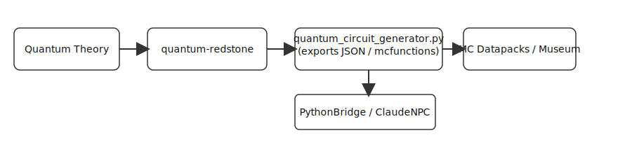

# Quantum ↔ Minecraft Mapping (SpiralSafe)

Purpose
- Provide a concise map of all Minecraft-linked and quantum-related content across the repository.
- Offer clear entry points and proposed visual elements for README and showcase pages.

Summary
- Core idea: Quantum-Redstone encodes quantum-topological concepts in Minecraft Redstone (Museum of Computation).
- Links: quantum-redstone repo (https://github.com/toolate28/quantum-redstone)

Key files (curated)

Museum builds (Minecraft artifacts)
- `museum/builds/logic-gates.json` — Redstone logic gates (building blocks, labels)
- `museum/builds/binary-counter.json` — Binary counter exhibit
- `museum/index.html` — Museum site and download/import instructions
- `museum/MINECRAFT_PLAY_SCHEDULE.md` — Play / testing schedule and instructions

Quantum circuit tooling
- `server-suite/python-scripts/quantum_circuit_generator.py` — Generates NBT/MC functions for quantum gates
- `server-suite/python-scripts/quantum_circuits.json` — Exported circuit definitions
- `server-suite/MANUAL_TESTING_GUIDE.md` & `PRISM_LAUNCHER_INTEGRATION.md` — How to run/build/import circuits

Integration & server
- `server-suite/ClaudeNPC/...` — PythonBridge integration to trigger circuit builds from NPCs
- `server-suite/PRISM_LAUNCHER_INTEGRATION.md` — Prism Launcher + ClaudeNPC quantum flow
- `server-suite/python-requirements-ml.txt` — optional quantum packages (qiskit, cirq)

Docs & theory
- `README.md` (root + SpiralSafe) — references to `quantum-redstone` and Museum of Computation
- `ARCHITECTURE.md` — Quantum Valley, conceptual integration
- `foundation/isomorphism-principle.md` — theoretical basis for discrete quantum analogs
- `CREDITS.md` — Historical and bibliographic references

Showcase & teaching
- `showcase/README.md` and `showcase/stories/*.md` — Minecraft missions, guided builds, pedagogy
- `showcase/diagrams/HARDWARE_INTEGRATION_MOCKUP.md` — diagrams referencing Minecraft
- `showcase/constellations/ECOSYSTEM_STAR_MAP.md` — high-level ecosystem map (candidate location for embedded visuals)

Cross-repo references
- `quantum-redstone` (external repo) — canonical circuit spec and mcfunction exports

Proposed visuals

1. High-level mapping diagram (Mermaid) showing: Repos / modules / flows: (Quantum theory) → `quantum-redstone` → circuit generator → MC datapacks / mcfunctions → Museum.

2. Dataflow diagram for `quantum_circuit_generator.py` and `PythonBridge` integration.

3. Museum floor map (SVG) showing exhibit placement: logic gates, binary counter, quantum gallery.

Mermaid: High-level flow

```mermaid
flowchart TD
  subgraph Theory
    QFT[Quantum Theory / Papers]
  end
  QFT --> QR[quantum-redstone repo]
  QR --> CG[quantum_circuit_generator.py]
  CG --> JSON[quantum_circuits.json / mcfunctions]
  JSON --> DP[MC Datapacks / mcfunctions]
  DP --> MUSEUM[Museum of Computation (Minecraft)]
  PythonBridge[PythonBridge / ClaudeNPC] --> CG
  PythonBridge --> MUSEUM
```

**Static diagram:** `docs/assets/quantum-minecraft-flow.svg` — embedded below for quick reference.



(Note: renderable Mermaid blocks will display on GitHub if supported; the SVG is included for clients without Mermaid rendering.)

