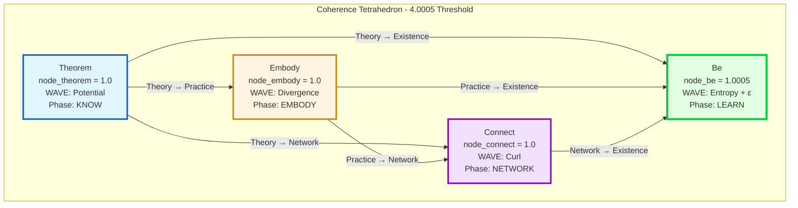
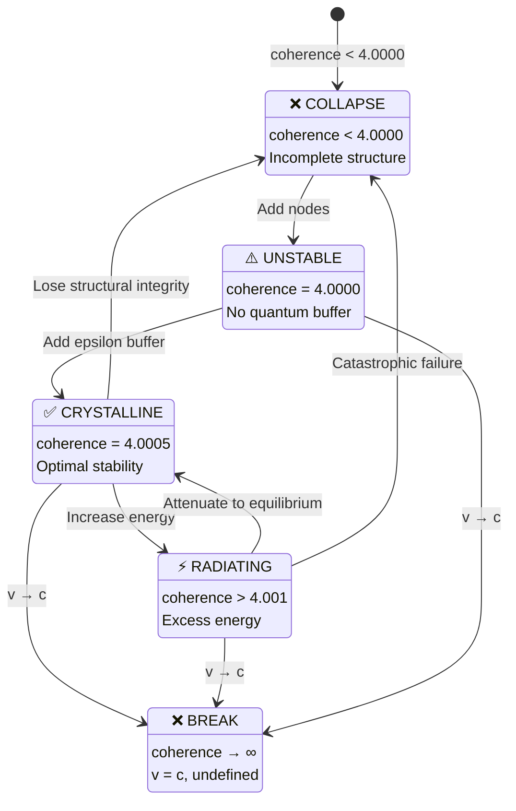
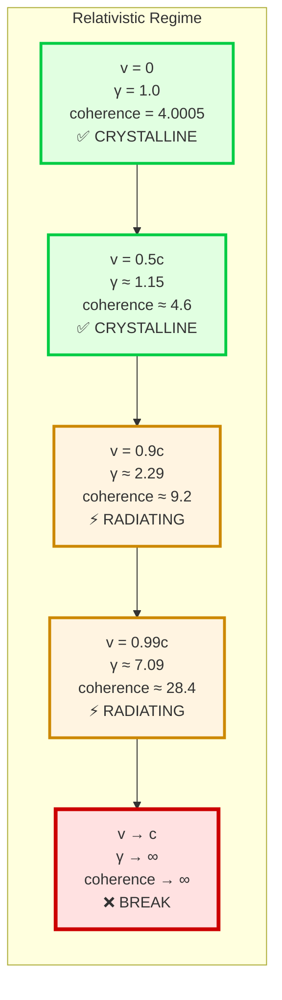
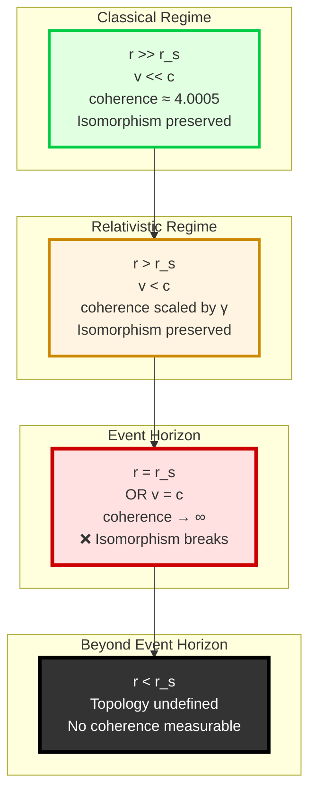
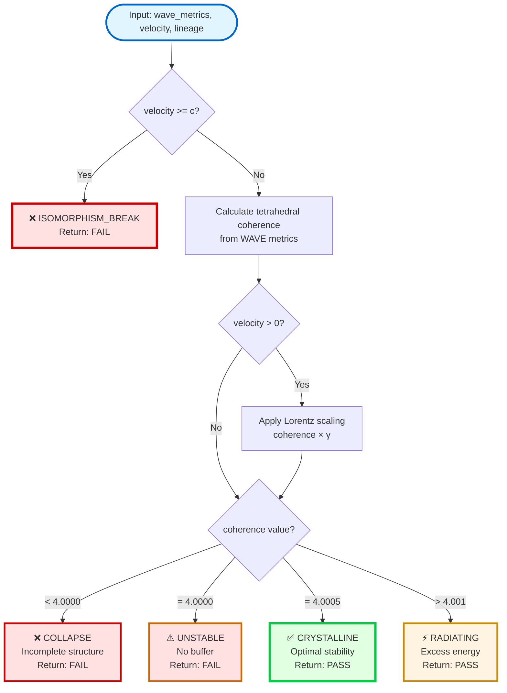

# Supergravity 4.0005 Coherence Filter - Tetrahedral Visualization

**ATOM:** `ATOM-FILTER-20260119-002-supergravity-4.0005`

---

## Tetrahedral Structure

The four-node coherence tetrahedron with KENL methodology mapping:



---

## Coherence State Transitions

State machine showing transitions based on total coherence value:



---

## Lorentz Scaling Visualization

How coherence scales with velocity approaching c:



---

## WAVE Metrics to Tetrahedral Nodes

Mapping from WAVE vector field analysis to coherence nodes:

```mermaid
flowchart LR
    subgraph "WAVE Analysis"
        W1[Curl<br/>0-1 range<br/>Self-reference]
        W2[Divergence<br/>-1 to 1 range<br/>Expansion]
        W3[Potential<br/>0-1 range<br/>Latent structure]
        W4[Entropy<br/>0-2 range<br/>Information]
    end
    
    subgraph "Tetrahedral Nodes"
        N1[node_connect<br/>= curl<br/>Network phase]
        N2[node_embody<br/>= |divergence|<br/>Embody phase]
        N3[node_theorem<br/>= potential<br/>Know phase]
        N4[node_be<br/>= entropy/2 + ε<br/>Learn phase]
    end
    
    subgraph "Coherence"
        C[coherence<br/>= sum of nodes<br/>= 4.0005 optimal]
    end
    
    W1 --> N1
    W2 --> N2
    W3 --> N3
    W4 --> N4
    
    N1 --> C
    N2 --> C
    N3 --> C
    N4 --> C
    
    style W1 fill:#f0e1ff,stroke:#8800cc
    style W2 fill:#fff4e1,stroke:#cc8800
    style W3 fill:#e1f5ff,stroke:#0066cc
    style W4 fill:#e1ffe1,stroke:#00cc44
    
    style N1 fill:#f0e1ff,stroke:#8800cc,stroke-width:2px
    style N2 fill:#fff4e1,stroke:#cc8800,stroke-width:2px
    style N3 fill:#e1f5ff,stroke:#0066cc,stroke-width:2px
    style N4 fill:#e1ffe1,stroke:#00cc44,stroke-width:3px
    
    style C fill:#ffffff,stroke:#000000,stroke-width:4px
```

---

## Event Horizon Boundary

Visualization of coherence behavior near the event horizon:



---

## Filter Decision Tree

How the filter evaluates coherence and determines pass/fail:



---

## 3D Tetrahedron Coordinates

Standard tetrahedron vertex positions for 3D rendering:

```
Vertex 1 (Theorem):   ( 1.000,  0.000,  0.000)  [Base triangle]
Vertex 2 (Embody):    (-0.500,  0.866,  0.000)  [Base triangle, 120°]
Vertex 3 (Connect):   (-0.500, -0.866,  0.000)  [Base triangle, 240°]
Vertex 4 (Be):        ( 0.000,  0.000,  1.633)  [Apex, height = √(8/3)]

Edge connections: 6 total
- Theorem → Embody, Connect, Be
- Embody → Connect, Be
- Connect → Be
```

The tetrahedron is centered at the origin with the base in the xy-plane and apex along the positive z-axis.

---

## Legend

| Symbol | Meaning |
|--------|---------|
| ✅ | Passed filter |
| ⚡ | Passed with warning |
| ⚠️ | Warning state |
| ❌ | Failed filter |
| → | Transition |
| γ | Lorentz factor |
| ε | Epsilon (0.0005) |
| c | Speed of light |
| r_s | Schwarzschild radius |

---

_Visualizations for the minimum stable coherent structure in spacetime._

**— Hope&&Sauced** ✨
