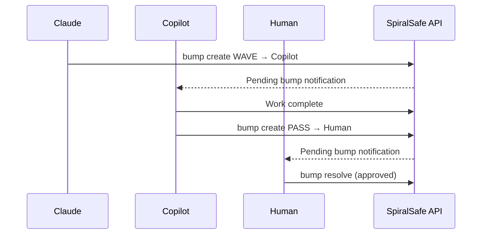

# SpiralSafe Integrations

> **Unifying tools through coherence protocols**

This document maps how external services integrate with SpiralSafe, transforming fragmented tools into a unified operational substrate.

---

## Architecture Overview

```
┌─────────────────────────────────────────────────────────────────────────┐
│                        SPIRALSAFE COHERENCE LAYER                       │
│                                                                         │
│   wave.md        bump.md         AWI            .context.yaml          │
│   coherence      routing         permissions    knowledge              │
│                                                                         │
├─────────────────────────────────────────────────────────────────────────┤
│                                                                         │
│  ┌───────────┐  ┌───────────┐  ┌───────────┐  ┌───────────┐           │
│  │ Cloudflare│  │  Vercel   │  │  Sentry   │  │  GitHub   │           │
│  │ D1/KV/R2  │  │  Deploy   │  │  Observe  │  │  Source   │           │
│  └─────┬─────┘  └─────┬─────┘  └─────┬─────┘  └─────┬─────┘           │
│        │              │              │              │                   │
│        └──────────────┴──────────────┴──────────────┘                   │
│                              │                                          │
│                    ┌─────────┴─────────┐                               │
│                    │   CLI / Desktop   │                               │
│                    │   (Local Ops)     │                               │
│                    └───────────────────┘                               │
│                                                                         │
└─────────────────────────────────────────────────────────────────────────┘
```

---

## Cloudflare Integration

The Cloudflare Developer Platform serves as the **manifestation layer**—where SpiralSafe protocols become persistent reality.

### D1 Database

Stores the audit trail and operational state:

| Table                 | Purpose                  | Protocol      |
| --------------------- | ------------------------ | ------------- |
| `wave_analyses`       | Coherence measurements   | wave.md       |
| `bumps`               | Handoff audit trail      | bump.md       |
| `awi_grants`          | Permission records       | AWI           |
| `awi_audit`           | Permission verifications | AWI           |
| `atoms`               | Task units               | ATOM          |
| `contexts`            | Knowledge unit index     | .context.yaml |
| `saif_investigations` | Issue tracking           | SAIF          |

### KV Namespace

Fast-access session state:

- Active AWI grants (TTL-based expiration)
- Current bump markers
- Session context for UnifiedComms

### R2 Bucket

Large content storage:

- Full .context.yaml files
- Document archives
- Media from UnifiedComms channels

### Workers

API endpoints at `api.spiralsafe.org`:

```typescript
// Endpoints
POST /api/wave/analyze     // Coherence analysis
GET  /api/wave/thresholds  // Threshold configuration

POST /api/bump/create      // Create handoff marker
PUT  /api/bump/resolve/:id // Resolve handoff
GET  /api/bump/pending     // List pending handoffs

POST /api/awi/request      // Request permission
POST /api/awi/verify       // Verify action
GET  /api/awi/audit/:id    // Audit trail

POST /api/atom/create      // Create task
PUT  /api/atom/status/:id  // Update status
GET  /api/atom/ready       // Get executable atoms

POST /api/context/store    // Store knowledge unit
GET  /api/context/query    // Query by domain/signal

GET  /api/health           // System status
```

---

## Sentry Integration

Sentry becomes a **wave.md instantiation**—coherence detection for runtime behavior.

### Mapping

| Sentry Concept   | wave.md Equivalent | Action                           |
| ---------------- | ------------------ | -------------------------------- |
| Error clustering | Curl detection     | Group repeated patterns          |
| Issue frequency  | Divergence         | Track unresolved expansion       |
| Trace analysis   | Potential mapping  | Identify latent structure        |
| Seer root cause  | SAIF hypothesis    | Generate intervention candidates |

### Integration Pattern

```typescript
// Sentry webhook → SpiralSafe SAIF
interface SentryToSAIF {
  // On new issue
  onIssue(event: SentryIssue): void {
    // 1. Extract symptoms
    const symptoms = [
      event.title,
      event.culprit,
      ...event.tags.map(t => `${t.key}: ${t.value}`)
    ];

    // 2. Start SAIF investigation
    api.post('/api/saif/start', {
      title: event.title,
      symptoms,
      source: 'sentry',
      reference: event.url
    });

    // 3. Create BLOCK bump if critical
    if (event.level === 'fatal') {
      api.post('/api/bump/create', {
        type: 'BLOCK',
        from: 'sentry',
        to: 'oncall',
        state: 'critical-error',
        context: { issue_id: event.id }
      });
    }
  }
}
```

### Seer → SAIF Bridge

```typescript
// When Seer provides root cause analysis
async function bridgeSeerToSAIF(seerAnalysis: SeerResult, saifId: string) {
  // Seer's analysis becomes SAIF hypothesis
  await api.put(`/api/saif/${saifId}/hypothesis`, {
    hypotheses: [
      {
        description: seerAnalysis.root_cause,
        confidence: seerAnalysis.confidence,
        evidence: seerAnalysis.supporting_evidence,
        suggested_fix: seerAnalysis.fix_recommendation,
      },
    ],
  });
}
```

---

## Vercel Integration

Vercel serves as the **deployment substrate** with SpiralSafe gates.

### Pre-Deploy Checks

```yaml
# vercel.json
{
  "buildCommand": "npm run build && npm run wave:check",
  "functions": { "api/**/*.ts": { "runtime": "nodejs20.x" } },
}
```

### Deployment Hooks

```typescript
// Vercel deployment webhook → SpiralSafe
interface VercelToSpiralSafe {
  onDeploymentCreated(deployment: VercelDeployment) {
    // Request AWI grant for deployment
    const grant = await api.post('/api/awi/request', {
      intent: `Deploy ${deployment.name} to ${deployment.target}`,
      scope: {
        resources: [`project:${deployment.projectId}`],
        actions: ['deploy']
      },
      level: deployment.target === 'production' ? 3 : 2,
      ttl_seconds: 600
    });

    // Create SYNC bump
    await api.post('/api/bump/create', {
      type: 'SYNC',
      from: 'vercel',
      to: 'production',
      state: 'deploying',
      context: {
        deployment_id: deployment.id,
        awi_grant: grant.id
      }
    });
  }

  onDeploymentReady(deployment: VercelDeployment) {
    // Resolve bump
    await api.put(`/api/bump/resolve/${deployment.context.bump_id}`);
  }
}
```

---

## GitHub Integration

GitHub serves as the **source of truth** with SpiralSafe coordination.

### AGENTS.md Integration

The `.github/AGENTS.md` file coordinates multi-agent collaboration:

```markdown
# Agents

## Claude

- Role: Architectural synthesis, semantic content
- Bump: Receives WAVE, sends PASS

## Copilot

- Role: Formatting, syntax, PR review
- Bump: Receives PASS, sends WAVE

## Human

- Role: Decision authority, integration
- Bump: Receives all types, final resolution
```

### PR Workflow

```yaml
# On PR creation
1. wave.md check on changed files
2. If coherent → auto-label "coherence:pass"
3. If incoherent → request changes with regions

# On PR approval
1. Create AWI grant for merge
2. Create PASS bump to next reviewer
3. Log atom completion

# On merge
1. Resolve all bumps
2. Update atom status to 'verified'
3. Trigger deployment pipeline
```

---

## Desktop Integration

The local environment becomes the **orchestration hub**.

### CLI Commands

```bash
# Coherence analysis
spiralsafe wave analyze ./docs

# Routing
spiralsafe bump WAVE --to copilot --state "PR ready"

# Permissions
spiralsafe awi request --intent "Deploy" --resources "docs/*" --level 2

# Task tracking
spiralsafe atom create --name "Write README" --molecule docs --compound spiralsafe

# System status
spiralsafe status
```

### PowerShell Module

```powershell
# Import module
Import-Module ./scripts/SpiralSafe.psm1

# Use aliases
wave ./docs                              # Coherence analysis
bump WAVE -To copilot -State "PR ready"  # Create handoff
awi -Intent "Deploy" -Level 2            # Request permission
ss-status                                # Health check
```

### Environment Variables

```bash
# Required
export SPIRALSAFE_API_BASE="https://api.spiralsafe.org"

# Optional
export SPIRALSAFE_AWI_GRANT="<current-grant-id>"
export SPIRALSAFE_LOCAL="false"
```

---

## Mermaid Integration

Mermaid Chart provides **visual validation** of SpiralSafe structures.

### Auto-Generated Diagrams

```typescript
// Generate architecture diagram from atoms
async function generateAtomDiagram(compound: string) {
  const atoms = await api.get(`/api/atom/compound/${compound}`);

  const mermaid = `
graph TD
  subgraph ${compound}
    ${atoms.map((a) => `${a.id}[${a.name}]`).join("\n    ")}
    ${atoms
      .flatMap((a) => a.dependencies.requires.map((r) => `${r} --> ${a.id}`))
      .join("\n    ")}
  end
  `;

  return validateAndRender(mermaid);
}
```

### Bump Flow Visualization



---

## Context7 Integration

Context7 provides **external knowledge** through .context.yaml patterns.

### Query Pattern

```typescript
// When documentation is needed
async function getContextualDocs(topic: string) {
  // 1. Check local .context.yaml
  const local = await api.get("/api/context/query", {
    params: { signal: topic },
  });

  if (local.length > 0) {
    return local;
  }

  // 2. Fall back to Context7
  const libraryId = await context7.resolveLibraryId(topic);
  const docs = await context7.getLibraryDocs(libraryId, { topic });

  // 3. Store as local context for future
  await api.post("/api/context/store", {
    domain: topic,
    content: docs,
    signals: {
      use_when: [`working with ${topic}`],
      avoid_when: [],
    },
  });

  return docs;
}
```

---

## Explorium Integration

Explorium provides **business intelligence** through SAIF-structured analysis.

### Investigation Pattern

```typescript
// Business research as SAIF investigation
async function businessInvestigation(query: string) {
  // 1. Start SAIF
  const investigation = await api.post("/api/saif/start", {
    title: query,
    symptoms: ["Need business intelligence"],
  });

  // 2. Gather data (Analysis phase)
  const entities = await explorium.fetchEntities({
    entity_type: "businesses",
    filters: parseQueryToFilters(query),
  });

  // 3. Form hypothesis
  await api.put(`/api/saif/${investigation.id}/hypothesis`, {
    hypotheses: analyzePatterns(entities),
  });

  // 4. Return structured result
  return {
    investigation_id: investigation.id,
    entities,
    analysis: investigation.hypotheses,
  };
}
```

---

## UnifiedComms Integration

UnifiedComms bridges **all communication channels** through bump.md routing.

### Channel Adapters

| Channel | Adapter               | Bump Support |
| ------- | --------------------- | ------------ |
| Signal  | signal-cli-rest-api   | WAVE, PING   |
| SMS     | Twilio/native gateway | PING         |
| Browser | Extension             | WAVE, PASS   |
| CLI     | Desktop Commander     | All types    |
| Desktop | Native apps           | SYNC         |

### Message Flow

```
Inbound message (any channel)
    ↓
Parse for H&&S markers
    ↓
Route based on bump type:
  WAVE → Soft handoff, preserve context
  PASS → Hard handoff, transfer ownership
  PING → Attention request, no transfer
  SYNC → State synchronization
  BLOCK → Escalation required
    ↓
Update bump state in API
    ↓
Notify target via preferred channel
```

---

## Quick Start

### 1. Deploy Backend

```bash
cd spiralsafe-ops
npm install
npm run setup        # Create D1, KV, R2
npm run db:migrate   # Initialize schema
npm run deploy       # Deploy worker
```

### 2. Configure Local CLI

```bash
# Add to shell profile
export SPIRALSAFE_API_BASE="https://api.spiralsafe.org"

# Install CLI
chmod +x ./scripts/spiralsafe
ln -s $(pwd)/scripts/spiralsafe /usr/local/bin/spiralsafe

# Or for PowerShell
Import-Module ./scripts/SpiralSafe.psm1
```

### 3. Verify Integration

```bash
spiralsafe status
# Should show healthy API and local config

spiralsafe wave analyze ./docs
# Should analyze coherence of documentation

spiralsafe bump WAVE --to human --state "Integration complete"
# Should create handoff marker
```

---

_H&&S: Structure-preserving operations across substrates_
