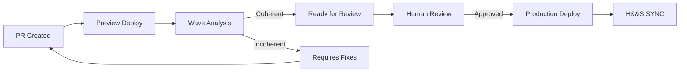

# Vercel Integration

> **Deployment as coherence manifestation**

Vercel serves as the deployment substrate where SpiralSafe protocols become observable reality. Every deployment is a coherence checkpoint, every preview a wave analysis opportunity.

---

## Conceptual Mapping

| Vercel              | SpiralSafe            | Insight                           |
| ------------------- | --------------------- | --------------------------------- |
| Preview deployments | **Wave analysis**     | Coherence check before production |
| Production deploy   | **AWI grant**         | Permission-gated manifestation    |
| Deployment hooks    | **Bump markers**      | State synchronization             |
| Build output        | **ATOM completion**   | Verified task artifacts           |
| Deploy URL          | **Context reference** | Addressable state                 |

---

## Configuration

### vercel.json

```json
{
  "buildCommand": "npm run build && npm run wave:check",
  "installCommand": "npm ci",
  "framework": null,
  "functions": {
    "api/**/*.ts": {
      "runtime": "nodejs20.x",
      "maxDuration": 30
    }
  },
  "env": {
    "SPIRALSAFE_API_BASE": "@spiralsafe_api_base"
  },
  "headers": [
    {
      "source": "/api/(.*)",
      "headers": [{ "key": "X-SpiralSafe-Version", "value": "1.0.0" }]
    }
  ]
}
```

### Environment Variables

Set in Vercel dashboard or CLI:

```bash
vercel env add SPIRALSAFE_API_BASE
# Value: https://api.spiralsafe.org

vercel env add SPIRALSAFE_DEPLOY_KEY
# Value: (generate unique key for this project)
```

---

## Deployment Hooks

### Pre-Build: Wave Check

```typescript
// scripts/wave-check.ts
import { execSync } from "child_process";

const API_BASE =
  process.env.SPIRALSAFE_API_BASE || "https://api.spiralsafe.org";

interface WaveResult {
  curl: number;
  divergence: number;
  coherent: boolean;
}

async function checkCoherence(): Promise<void> {
  console.log(
    "═══════════════════════════════════════════════════════════════",
  );
  console.log("  SpiralSafe Wave Check (Pre-Build)");
  console.log(
    "═══════════════════════════════════════════════════════════════",
  );

  // Find documentation files
  const files = execSync('find . -name "*.md" -not -path "./node_modules/*"')
    .toString()
    .trim()
    .split("\n")
    .filter(Boolean);

  let failures = 0;

  for (const file of files) {
    const content = execSync(`cat "${file}"`).toString();

    const response = await fetch(`${API_BASE}/api/wave/analyze`, {
      method: "POST",
      headers: { "Content-Type": "application/json" },
      body: JSON.stringify({ content }),
    });

    const result: WaveResult = await response.json();

    if (!result.coherent) {
      console.log(
        `⚠ ${file} - curl:${result.curl.toFixed(2)} div:${result.divergence.toFixed(2)}`,
      );
      failures++;
    } else {
      console.log(`✓ ${file}`);
    }
  }

  console.log(
    "───────────────────────────────────────────────────────────────",
  );

  if (failures > 0) {
    console.log(`⚠ ${failures} file(s) below coherence threshold`);
    // Don't fail build, but log warning
    // process.exit(1); // Uncomment to enforce
  } else {
    console.log("✓ All files pass coherence checks");
  }
}

checkCoherence().catch(console.error);
```

### Post-Deploy: State Sync

```typescript
// api/webhooks/vercel.ts
interface VercelDeployHook {
  type: "deployment.created" | "deployment.succeeded" | "deployment.failed";
  payload: {
    deployment: {
      id: string;
      url: string;
      name: string;
      meta: Record<string, string>;
    };
    project: {
      id: string;
      name: string;
    };
    target: "production" | "preview";
  };
}

export async function handleVercelWebhook(
  request: Request,
  env: Env,
): Promise<Response> {
  const hook = (await request.json()) as VercelDeployHook;
  const { type, payload } = hook;

  switch (type) {
    case "deployment.created":
      return handleDeploymentCreated(payload, env);
    case "deployment.succeeded":
      return handleDeploymentSucceeded(payload, env);
    case "deployment.failed":
      return handleDeploymentFailed(payload, env);
    default:
      return new Response("OK", { status: 200 });
  }
}

async function handleDeploymentCreated(
  payload: VercelDeployHook["payload"],
  env: Env,
): Promise<Response> {
  const { deployment, project, target } = payload;

  // 1. Request AWI grant for deployment
  const grantLevel = target === "production" ? 3 : 2;

  await env.SPIRALSAFE_DB.prepare(
    `
    INSERT INTO awi_grants (id, intent, scope, level, granted_at, expires_at)
    VALUES (?, ?, ?, ?, ?, ?)
  `,
  )
    .bind(
      `awi-vercel-${deployment.id}`,
      `Deploy ${project.name} to ${target}`,
      JSON.stringify({
        resources: [`project:${project.id}`, `deployment:${deployment.id}`],
        actions: ["deploy", "activate"],
      }),
      grantLevel,
      new Date().toISOString(),
      new Date(Date.now() + 600000).toISOString(), // 10 min TTL
    )
    .run();

  // 2. Create SYNC bump
  await env.SPIRALSAFE_DB.prepare(
    `
    INSERT INTO bumps (id, type, from_agent, to_agent, state, context, timestamp, resolved)
    VALUES (?, ?, ?, ?, ?, ?, ?, ?)
  `,
  )
    .bind(
      `bump-vercel-${deployment.id}`,
      "SYNC",
      "vercel",
      target,
      "deploying",
      JSON.stringify({
        deployment_id: deployment.id,
        deployment_url: deployment.url,
        project: project.name,
        target,
      }),
      new Date().toISOString(),
      0,
    )
    .run();

  return new Response(
    JSON.stringify({
      awi_grant: `awi-vercel-${deployment.id}`,
      bump: `bump-vercel-${deployment.id}`,
    }),
    { status: 200 },
  );
}

async function handleDeploymentSucceeded(
  payload: VercelDeployHook["payload"],
  env: Env,
): Promise<Response> {
  const { deployment, project, target } = payload;

  // 1. Resolve the deployment bump
  await env.SPIRALSAFE_DB.prepare(
    `
    UPDATE bumps 
    SET resolved = 1, resolved_at = ?, resolution_notes = ?
    WHERE id = ?
  `,
  )
    .bind(
      new Date().toISOString(),
      `Successfully deployed to ${target}`,
      `bump-vercel-${deployment.id}`,
    )
    .run();

  // 2. Log completion in wave_analyses as coherence checkpoint
  await env.SPIRALSAFE_DB.prepare(
    `
    INSERT INTO wave_analyses 
    (id, content_hash, curl, divergence, potential, coherent, analyzed_at, source, metadata)
    VALUES (?, ?, ?, ?, ?, ?, ?, ?, ?)
  `,
  )
    .bind(
      `deploy-${deployment.id}`,
      deployment.id,
      0, // Successful deploy = no repetition issues
      0, // No divergence (resolved)
      0, // Potential realized
      1, // Coherent
      new Date().toISOString(),
      "vercel",
      JSON.stringify({
        project: project.name,
        target,
        url: deployment.url,
      }),
    )
    .run();

  // 3. Create ATOM for deployment tracking
  await env.SPIRALSAFE_DB.prepare(
    `
    INSERT INTO atoms (id, name, molecule, compound, status, verification, dependencies, assignee, created_at, updated_at, completed_at, verified_at)
    VALUES (?, ?, ?, ?, ?, ?, ?, ?, ?, ?, ?, ?)
  `,
  )
    .bind(
      `atom-deploy-${deployment.id}`,
      `Deploy to ${target}`,
      "deployment",
      project.name,
      "verified",
      JSON.stringify({
        criteria: { deployed: true, url: deployment.url },
        automated: true,
      }),
      JSON.stringify({ requires: [], blocks: [] }),
      "vercel",
      new Date().toISOString(),
      new Date().toISOString(),
      new Date().toISOString(),
      new Date().toISOString(),
    )
    .run();

  return new Response(
    JSON.stringify({
      status: "deployed",
      url: deployment.url,
      coherent: true,
    }),
    { status: 200 },
  );
}

async function handleDeploymentFailed(
  payload: VercelDeployHook["payload"],
  env: Env,
): Promise<Response> {
  const { deployment, project, target } = payload;

  // 1. Create BLOCK bump
  await env.SPIRALSAFE_DB.prepare(
    `
    UPDATE bumps 
    SET type = 'BLOCK', state = 'deployment-failed', to_agent = 'engineering'
    WHERE id = ?
  `,
  )
    .bind(`bump-vercel-${deployment.id}`)
    .run();

  // 2. Start SAIF investigation
  await env.SPIRALSAFE_DB.prepare(
    `
    INSERT INTO saif_investigations (id, title, phase, symptoms, created_at, updated_at)
    VALUES (?, ?, ?, ?, ?, ?)
  `,
  )
    .bind(
      `saif-deploy-${deployment.id}`,
      `Deployment failure: ${project.name} to ${target}`,
      "symptom",
      JSON.stringify([
        "Vercel deployment failed",
        `Project: ${project.name}`,
        `Target: ${target}`,
        `Deployment ID: ${deployment.id}`,
      ]),
      new Date().toISOString(),
      new Date().toISOString(),
    )
    .run();

  return new Response(
    JSON.stringify({
      status: "failed",
      saif_investigation: `saif-deploy-${deployment.id}`,
    }),
    { status: 200 },
  );
}
```

---

## CLI Integration

```bash
# Check deployment status through SpiralSafe
spiralsafe vercel status --project my-project

# View deployment coherence history
spiralsafe vercel coherence --last 10

# Manually create deployment bump
spiralsafe bump SYNC --to production --state "manual-deploy" \
  --context '{"project":"my-project","method":"manual"}'
```

---

## Preview Deployments as Wave Analysis

Each Vercel preview deployment becomes a coherence checkpoint:



---

## Dashboard Queries

### Deployment Coherence History

```sql
SELECT
  id,
  json_extract(metadata, '$.project') as project,
  json_extract(metadata, '$.target') as target,
  coherent,
  analyzed_at
FROM wave_analyses
WHERE source = 'vercel'
ORDER BY analyzed_at DESC
LIMIT 20;
```

### Failed Deployments Under Investigation

```sql
SELECT
  s.id,
  s.title,
  s.phase,
  b.state as bump_state,
  s.created_at
FROM saif_investigations s
JOIN bumps b ON b.id = 'bump-vercel-' || REPLACE(s.id, 'saif-deploy-', '')
WHERE s.id LIKE 'saif-deploy-%'
AND s.resolved_at IS NULL
ORDER BY s.created_at DESC;
```

---

_H&&S: Deployment coherence through structured gates_
